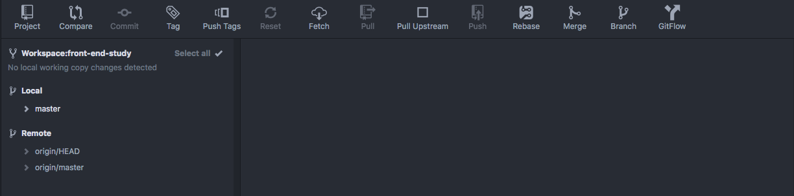
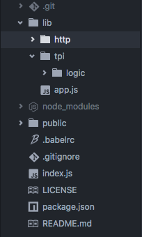

[Atom](https://atom.io/) 是 Github 官方开发的一款可定制化的文本编辑器。有两点需要注意一下，一是 Atom 是由 Github 官方开发，二是其定制化程度非常高。前者的结果是编辑器对 Github 非常友好，如果项目托管在 Github 上的话，用 Atom 可以很方便地进行 Git 操作。后者的结果就是我们可以根据自己的需要定制自己的编辑器，使得自己的效率最大化，也让自己舒舒服服、开开心心地码代码。

下载好对应操作系统的 Atom 并且安装后，首先就是进入设置界面（Windows 下的 Settings 或 Mac 下的 Preferences)。Atom 设置的一个我认为最大的好处就是，她将所有的设置都通过图形化界面来操作，而不像一些编辑器通过一大堆很繁琐的配置文件。你会看到设置界面的导航栏：

分别是：

- Core：这部分是整个编辑器的核心设置，一般情况下全部默认即可
- Editor： 主要对编辑器的可视化进行设置，一般修改样式即可
- Keybingdings： 编辑器中操作的快捷键
- Packages： Atom 集成了很多的包，这是她可以被定制化的一个重要因素。在这里会看到 Atom 装的所有包
- Themes： Atom 的主题，也可以被定制化
- Updates： 显示需要更新的包或者主题
- Install： 在这个界面，我们可以安装各种各样的包、主题，这是我们用的最多的一个菜单

Core 部分有一个比较常用，就是 “Ignored Names”。在这里你可以列举不想在左侧文件列表里看到的文件或文件夹，比如 node_modules。

你可以在 Editor 部分设置编辑器的 Font Family, Font Size 等等。我的习惯是这些都默认，除了三个：

- Tab Length： 改成 4，意思是一个 Tab 键占用 4 个空格，默认是 2 个
- Scroll Past End： 选中，意思是你可以将代码的最后一行显示在屏幕的最上方

    

- Show Indent Guide： 选中，可以清晰地标记同一层次的代码，当代码嵌套层次比较复杂时尤其有用

    

Themes 部分你可以设置编辑器的主题，我采用了默认的主题。如果你不喜欢默认的主题，那你可以去尝试一下其他主题。Atom 自带了几种主题，另外你也可以从网上下载安装，比如 Material Design 风格的。具体安装主题的方法同安装一般的插件包一样，我接下来就重点介绍这一部分。

Install 部分，我们可以搜索并安装 Atom 的插件包或主题。下面我主要介绍一下我主要使用的 packages：

- git-control： 这是我最常使用的 package，我可以不用记很多繁琐的 git 命令，常用的命令都能用界面完成，简单便捷，又能减少出错

    

- platformio-ide-terminal： 可以在 Atom 中直接打开终端

    

- autocomplete-paths： 自动补全路径
- autocomplete-modules： 自动补全模块名
- auto-fold： 可以折叠代码
- file-icons： 根据文件类型显示不同的图标

    

- pigments：显示颜色
- color-picker： 以可视化的方式编辑颜色
- minimap：显示代码的缩略图，用过 sublime 的小伙伴会比较熟悉
- emmet： 写 HTML 的利器，根据特定语法快速生成 HTML
