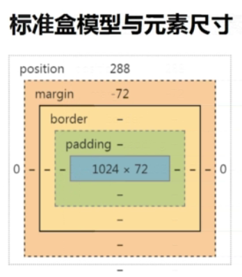
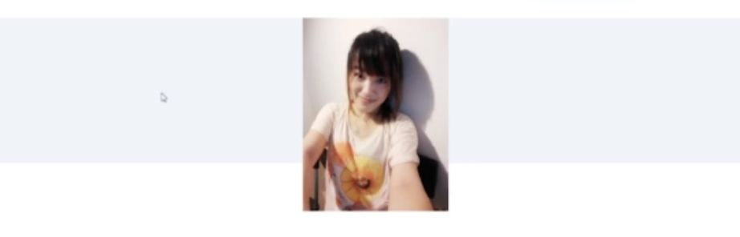
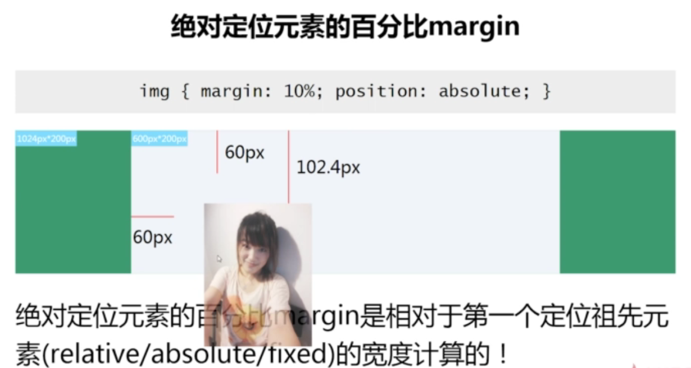
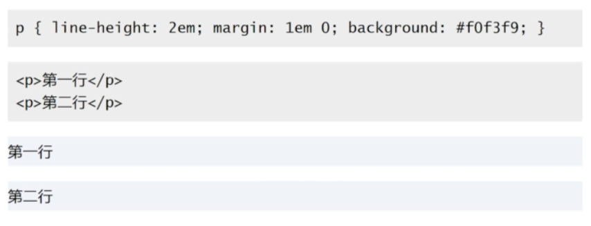
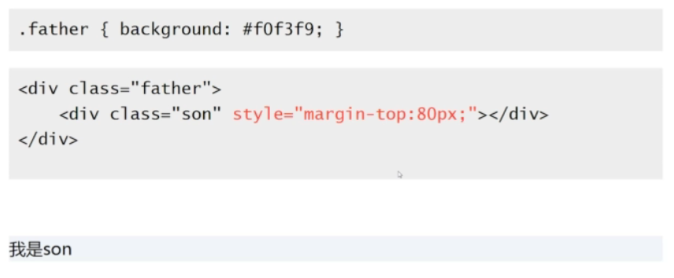

# 深入理解 margin

## margin 与容器尺寸

标准盒模型与元素尺寸



元素尺寸：

- 可视尺寸： clientWidth(标准)
- 占据尺寸： outerWidth

### margin 与可视尺寸

1. 适用于没有设定 width / height 的普通 block 水平元素；
2. 只适用于水平方向尺寸（即 margin 只会修改水平方向尺寸）

`margin: 50px;`


`margin: 50px -50px;`


`margin: 30px 100px;`


应用场景：

- 一侧定宽的自适应布局

```

<p>图片左浮动...</p>
```


对 `<p></p>` 加一个 `margin` 属性，可以达到一侧定宽的效果。

```

<p style="margin-left: 180px">图片左浮动...</p>
```


### margin 与占据尺寸（元素占据的空间）

1. block / inline-block 水平元素均适用；
2. 与有没有设定 width / height 值无关；
3. 适用于水平方向和垂直方向

`margin-bottom: 0;`


`margin-bottom: -50px;`



`margin-bottom: 50px;`


应用场景：

- 滚动容器上下留白


注：此处 `padding` 只有在chrome 浏览器中才能实现上下留白，其他浏览器只能用 `margin` 来实现。

- 等高布局


## margin 与百分比单位




应用场景：

- 宽高 2:1 自适应矩形

```css
.box {
    background-color: olive;
    overflow: hidden;
}

.box > div {
    margin: 50%;
}
```


## margin 重叠

特性：

- block 水平元素（不包括 float 和 absolute 元素）
-  不考虑 writing-mode， 只发生在垂直方向（margin-top 和 margin-bottom）

margin 重叠 3 种情境：

1. 相邻的兄弟元素

    

2. 父级和第一个 / 最后一个子元素

    

    

    
    发现上面三段的代码效果是一样的。

    父子 margin 重叠其他条件：

    - margin-top 重叠：
        - 父元素非块状格式化上下文元素
        - 父元素没有 border-top 设置
        - 父元素没有 padding-top 值
        - 父元素和第一个子元素之间没有 inline 元素分割
    - margin-bottom 重叠：
        - 父元素非块状格式化上下文元素
        - 父元素没有 border-bottom 设置
        - 父元素没有 padding-bottom 值
        - 父元素和最后一个子元素之间没有 inline 元素分割
        - 父元素没有 height， min-height, max-height 限制

3. 空的 block 元素

    

    空 block 元素 margin 重叠其他条件：

    - 元素没有 border 设置
    - 元素没有 padding 值
    - 里面没有 inline 元素
    - 没有 height，或者 min-height
