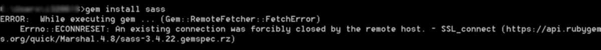

SASS 是 CSS 的预处理语言，跟 LESS 有很大的相同之处，知道 LESS 的人学习 SASS 难度并不大。

## 安装

### Windows

首先需要安装 `Ruby`。

在 Windows 下使用 [RubyInstaller](http://rubyinstaller.org/downloads/) 安装。安装好了之后搜索 `ruby` 打开 Ruby 控制台。

```
gem install sass
```

如果遇到下面的问题：



则：

```
gem sources --add https://ruby.taobao.org/ --remove https://rubygems.org/
```

如果遇到下面的问题：


则点击[这里](https://github.com/ruby-china/rubygems-mirror/wiki)寻找解决方案。
