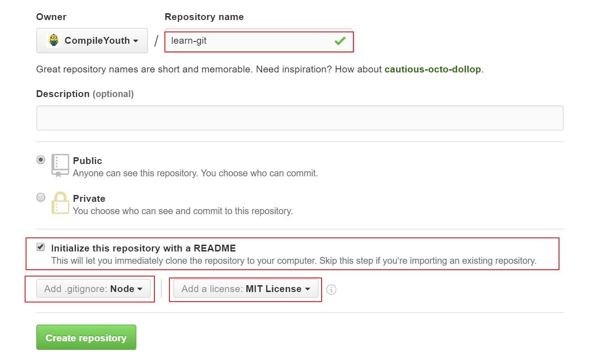

新手推荐廖雪峰老师的[Git 教程](http://www.liaoxuefeng.com/wiki/0013739516305929606dd18361248578c67b8067c8c017b000)

也可以参考其他教程网站：

1. [Git 官方文档](https://git-scm.com/book/zh/v2)
2. [图解 Git](https://marklodato.github.io/visual-git-guide/index-zh-cn.html)
3. [Git Cheatsheet 中文版](./git-cheatsheet-CN-dark.pdf)或者[Git Cheatsheet 英文版](./git-cheatsheet-EN-dark.pdf)

看完了教程，下面我们搭建一个实例来巩固一下内容。

我们先在 Github 新建一个叫 "learn-git" 的项目，如下：



复制项目的地址：


下面我们在本地 clone 这个项目，选择目标文件夹，打开 "git bash" 输入命令：

```
git clone https://github.com/CompileYouth/learn-git.git
```

你应该将项目 URL 替换成你在上一步复制的项目地址。

进入项目：

```
cd learn-git
```

至此，你已经成功拷贝远程代码仓库的代码至本地。

目前，我们当前的分支为 master 分支，但是 master 的代码一般表示项目的最终结果，即经过测试的稳定的代码。习惯上，开发过程中的代码应存放在 dev 分支上。所以我们在本地应切换到 dev 分支上：

```
git checkout -b dev
```

使用 `git branch` 命令查看当前是否处于 dev 分支上。

输入以下命令上传 dev 分支至远程仓库：

```
git push origin dev
```

开发过程中，通常需要添加一项新的功能，此时需要在 dev 分支基础上新创建一个分支，分支名以 "issue" 开头。比如下面我需要修改 README.md 文件，则：

```
git checkout -b feature-readme
```

修改完 README.md 文件后，先把代码提交到本地仓库。

```
git add README.md
git commit -m "Modify README.md in branch feature-readme."
```

下面回到 dev 分支，将 feature-readme 分支合并到当前分支。

```
git checkout dev
git merge feature-readme
```

再将代码提交至远程仓库的 dev 分支上：

```
git push origin dev
```

确认正确提交后，可以将本地的 feature-readme 分支删除。

```
git branch -d feature-readme
```
