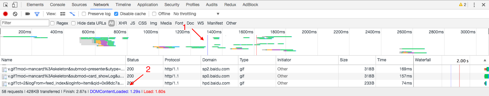
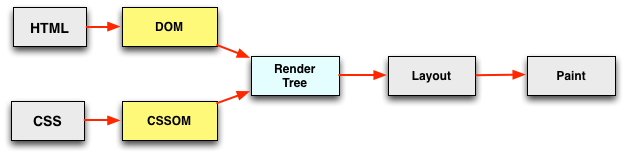

# 详解 DOMContentLoaded

首先我们先直观地感受下什么是 DOMContentLoaded。打开 Chrome DevTools，切到 Network 面板，重新加载网页，得到如下截图：



标记 1 指向的蓝线以及标记 2 指向的蓝色字 “DOMContentLoaded:1.29s” 均表示 DOMContentLoaded 这个事件触发的时间，只不过表现形式不同而已。

直观地感受了 DOMContentLoaded，那它究竟是个什么东东呢？

## 什么是 DOMContentLoaded

有兴趣的可以看下 [W3C 的 HTML5 规范](https://www.w3.org/TR/html5/syntax.html#the-end)是如何描述 DOMContentLoaded 的，不感兴趣也没关系，我们继续往下走。那么我们可以看一下 [MDN 对 DOMContentLoaded 的描述](https://developer.mozilla.org/en-US/docs/Web/Events/DOMContentLoaded)，啥，你还是不感兴趣啊？也没关系，接触一个新概念时，没人喜欢一上来就看那么晦涩的文字的。那我下面就用通俗的语言跟你聊聊什么是 DOMContentLoaded。

我们先来思考一个问题，如何衡量一个网页的加载速度？

有人说可以用网页加载完全的时间来衡量。我觉得这没有问题，但不够好。为什么呢？在日常生活中，很多时候因为网络原因我们并不需要等待网页上的所有内容都加载完毕，而是只需要加载主要内容就可以了，比如你打开这篇博客时，可能并不需要等所有图片都加载完成，而是看到博客的正文就可以正常阅读了。把上面的话提炼一下就是，用户有时候只需要在空白的网页上看见内容就可以了，而不需要等待所有内容都加载出来。那既然这样，回到刚刚的问题，我觉得衡量一个网页加载速度的一个方法就是“计算这个网页从空白到出现内容所花费的时间”。那怎么计算这段时间？[HTML5 规范](https://www.w3.org/TR/html5/syntax.html#the-end)已经帮我们完成了相应的工作，就是当一个 HTML 文档被加载和解析完成后，DOMContentLoaded 事件便会被触发。

这时问题又来了，“HTML 文档被加载和解析完成”是什么意思呢？或者说，HTML 文档被加载和解析完成之前，浏览器做了哪些事情呢？那我们需要从浏览器渲染原理来谈谈。

浏览器向服务器请求到了 HTML 文档后便开始解析，产物是 DOM（文档对象模型），到这里 HTML 文档就被加载和解析完成了。如果有 CSS 的会根据 CSS 生成 CSSOM（CSS 对象模型），然后再由 DOM 和 CSSOM 合并产生渲染树。有了渲染树，知道了所有节点的样式，下面便根据这些节点以及样式计算它们在浏览器中确切的大小和位置，这就是布局阶段。有了以上这些信息，下面就把节点绘制到浏览器上。所有的过程如下图所示：



现在你可能了解 HTML 文档被加载和解析完成前浏览器大概做了哪些工作，但还没完，因为我们还没有考虑现在前端的主角之一 JavaScript。

JavaScript 可以阻塞 DOM 的生成，也就是说当浏览器在解析 HTML 文档时，如果遇到 `<script>`，便会停下对 HTML 文档的解析，转而去处理脚本。如果脚本是内联的，浏览器会先去执行这段内联的脚本，如果是外链的，那么先会去加载脚本，然后执行。在处理完脚本之后，浏览器便继续解析 HTML 文档。看下面的例子：

```html
<body>
  <script type="text/javascript">
  console.log(document.getElementById('ele')); // null
  </script>

  <div id="ele"></div>

  <script type="text/javascript">
  console.log(document.getElementById('ele')); // <div id="ele"></div>
  </script>
</body>
```

另外，因为 JavaScript 可以查询任意对象的样式，所以意味着在 CSS 解析完成，也就是 CSSOM 生成之后，JavaScript 才可以被执行。

到这里，我们可以总结一下。当文档中没有脚本时，浏览器解析完文档便能触发 DOMContentLoaded 事件；如果文档中包含脚本，则脚本会阻塞文档的解析，而脚本需要等 CSSOM 构建完成才能执行。在任何情况下，DOMContentLoaded 的触发不需要等待图片等其他资源加载完成。

## 异步脚本

我们到这里一直在说同步脚本对网页渲染的影响，如果我们想让页面尽快显示，那我们可以使用异步脚本。HTML5 中定义了两个定义异步脚本的方法：defer 和 async。我们来看一看他们的区别。


同步脚本（标签中不含 async 或 defer）： `<script src="***.js" charset="utf-8"></script>`

当 HTML 文档被解析时如果遇见（同步）脚本，则停止解析，先去加载脚本，然后执行，执行结束后继续解析 HTML 文档。过程如下图：


defer 脚本：`<script src="***.js" charset="utf-8" defer></script>`

当 HTML 文档被解析时如果遇见 defer 脚本，则在后台加载脚本，文档解析过程不中断，而等文档解析结束之后，defer 脚本执行。另外，defer 脚本的执行顺序与定义时的位置有关。过程如下图：


async 脚本：`<script src="***.js" charset="utf-8" async></script>`

当 HTML 文档被解析时如果遇见 async 脚本，则在后台加载脚本，文档解析过程不中断。脚本加载完成后，文档停止解析，脚本执行，执行结束后文档继续解析。过程如下图：


（图片来源：[async vs defer attributes](http://www.growingwiththeweb.com/2014/02/async-vs-defer-attributes.html))

如果你 Google "async 和 defer 的区别"，你可能会发现一堆类似上面的文章或图片，而在这里，我想跟你分享的是 async 和 defer 对 DOMContentLoaded 事件触发的影响。

**defer 与 DOMContentLoaded**

如果 script 标签中包含 defer，那么这一块脚本将不会影响 HTML 文档的解析，而是等到 HTML 解析完成后才会执行。而 DOMContentLoaded 只有在 defer 脚本执行结束后才会被触发。 所以这意味着什么呢？HTML 文档解析不受影响，等 DOM 构建完成之后 defer 脚本执行，但脚本执行之前需要等待 CSSOM 构建完成。在 DOM、CSSOM 构建完毕，defer 脚本执行完成之后，DOMContentLoaded 事件触发。

**async 与 DOMContentLoaded**

如果 script 标签中包含 async，则 HTML 文档构建不受影响，解析完毕后，DOMContentLoaded 触发，而不需要等待 async 脚本执行、样式表加载等等。

## DOMContentLoaded 与 load

在回头看第一张图：


与标记 1 的蓝线平行的还有一条红线，红线就代表 load 事件触发的时间，对应的，在最下面的概览部分，还有一个用红色标记的 "Load:1.60s"，描述了 load 事件触发的具体时间。

这两个事件有啥区别呢？点击这个网页你就能明白：<https://testdrive-archive.azurewebsites.net/HTML5/DOMContentLoaded/Default.html>

解释一下，当 HTML 文档解析完成就会触发 DOMContentLoaded，而所以资源加载完成之后，load 事件才会被触发。

另外需要提一下的是，我们在 jQuery 中经常使用的 `$(document).ready(function() { // ...代码... });` 其实监听的就是 DOMContentLoaded 事件，而 `$(document).load(function() {  // ...代码... });` 监听的是 load 事件。
