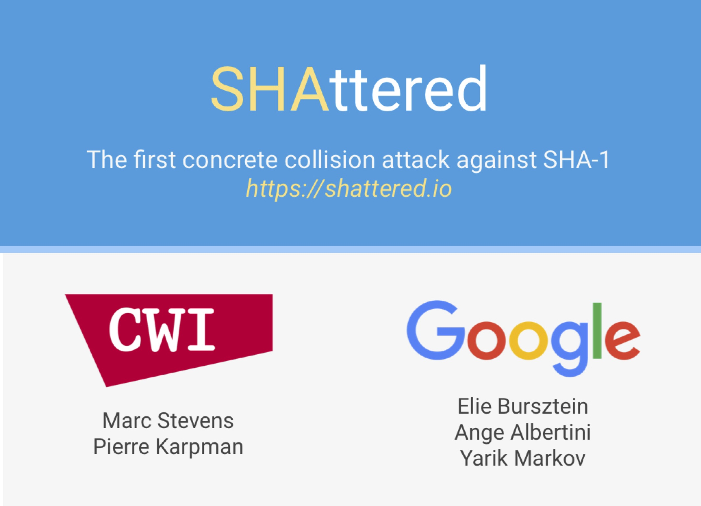
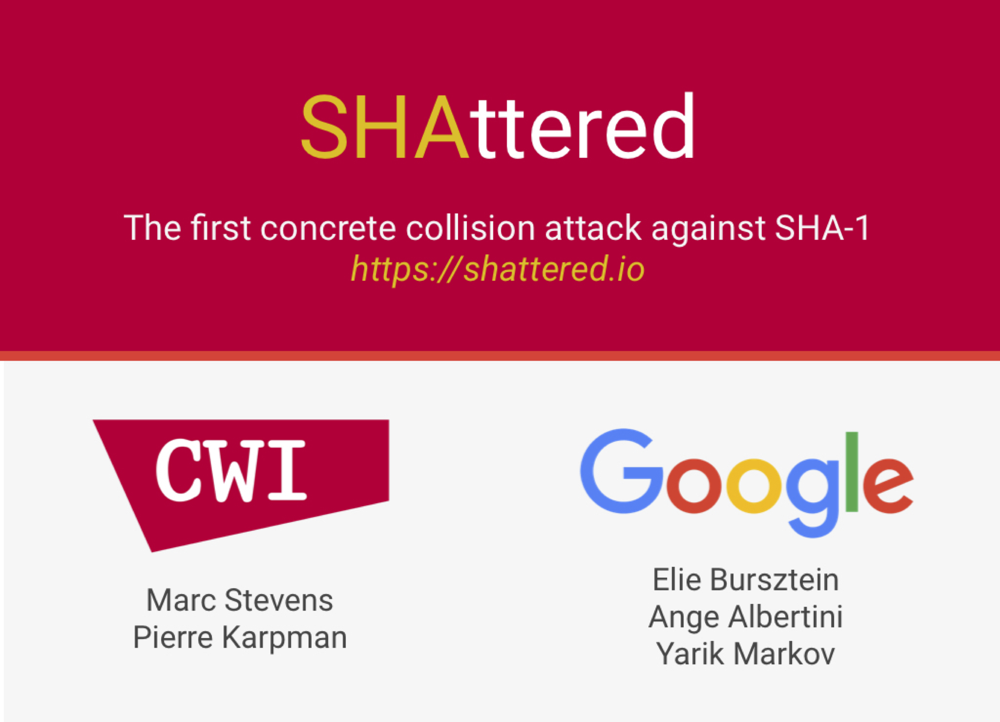

# 一篇文章让你知道被 Google 攻破的 SHA-1 是什么

前段时间被一个重大的新闻刷屏了，那就是 Google 攻破了 SHA-1。很多人看了后的第一反应大概就是：哦，知道了~ 很多事情看起来跟我们无关，实际上却对我们产生了巨大的影响，比如川普当选总统，我们很多人总觉得这事离我们很遥远，但其实就像一滴水滴落水中，很快便会波及四周。Google 攻破 SHA-1 这事也是，看似跟我们无关，其实与我们息息相关。鸡汤不说了，下面我们具体地聊一聊这个 SHA-1。

我们先从 HTTP 协议讲起。搞前端的绝大多数对此并不陌生，HTTP 协议就是在网络中用于客户端和服务器端之间通信的一种协议。所谓协议，就是一种约定，约定通信的双方由谁发起通信，信件应该发往何处，信件的格式什么样，怎样结束通信等等事项。就好比一个人要给另一个人写信，首先要确定信应该寄到哪里，再确定信的格式怎么写才能让对方看得懂以及怎么确认对方收到信等等问题，这些都是 HTTP 协议所规定的。

有了这些约定，我们客串之一赵铁柱按照约定写好信件打算寄给李小花，下面信件就上路了。这个时候，问题来了...

- 这封信件可能半路被张全蛋给偷看了，那可是满满的羞羞的情话啊！
- 这封信件可能被张全蛋修改了，信的结尾坦白自己其实喜欢男的...
- 李小花收到了信，但她怎么能确定这是赵铁柱写的，而不是张全蛋或者其他人写的呢？（这个问题这里不谈）

好在赵铁柱进厂组装手机前干过锁匠，他便想出了一个办法。

他发明了一种“鸳鸯锁”，这种锁高级了，有两把钥匙，A 钥匙、B钥匙，这把锁如果用 A 钥匙锁上的话只能用 B 钥匙打开，而用 B 钥匙锁上的话只能用 A 钥匙打开。这样，他也为李小花做了一把鸳鸯锁，并把 A 钥匙（私钥）留给了李小花自己，而把 B 钥匙（公钥）拿了过来，每次他写信时就用李小花的 B 钥匙把信件加密，而解密的钥匙，即钥匙 A 只有李小花有，这样就保证了安全。反过来，李小花想发信件，就用赵铁柱的公钥加密，然后赵铁柱用自己的私钥解密。

这样还不够，赵铁柱还担心信在中途被人篡改了，好在他干锁匠前也干过码农，于是他又想到一种方法。（请注意，下面我们今天的主人公登场）

他用计算机写了个算法，这个算法的特点就是根据不同的内容生成一串字符，就是说当内容一样时，生成的字符一定是一样的，而只要内容发生一丁点改变，生成的字符串就完全变了样。举个例子，你们感受下：

```
我爱你：5890a73fed38bf09622c34ad9391f1d09c0ec100
我不爱你：39e22987f658c46a8eab02e6302dc980d9236014
```

这样赵铁柱每次发信件前会用这个算法根据自己信的内容生成一个字符串，然后把这个字符串也用上面的加密的方式发送给李小花。这样，李小花收到了两样东西，一个是信本身，还有一个是赵铁柱根据信件原文生成的字符串。李小花用赵铁柱给他的这个算法根据她收到的信也生成一个字符串，然后跟收到的字符串比对，如果一样，那基本肯定这封信的内容没有被人给篡改过。

这样， 赵铁柱和李小花过上了安安静静谈恋爱的生活~张全蛋却孤独终老...（画外音：找个会写代码的男票多重要！）

然而，我们的故事才刚刚开始。

上面赵铁柱发明的这个算法叫做 SHA-1，属于 [SHA 家族](https://zh.wikipedia.org/wiki/SHA%E5%AE%B6%E6%97%8F)，SHA-1 是一个 [Hash 函数](https://zh.wikipedia.org/wiki/%E6%95%A3%E5%88%97%E5%87%BD%E6%95%B8)，在这个使用场景下叫做[密码散列函数](https://zh.wikipedia.org/wiki/%E5%AF%86%E7%A2%BC%E9%9B%9C%E6%B9%8A%E5%87%BD%E6%95%B8)。

SHA-1 的特点就是：1）特定的内容生成同样的结果（一个固定长度的字符串）；2）内容不一样则生成的不一样的结果。但是，这仅仅是理想情况罢了。特点 1 是没有争议的，但特点 2 真的在所有情况下都这样吗？有没有一种可能就是，两个不一样的内容生成的结果是一样的呢？答案是有的。这种情况还有个专有名词，“哈希碰撞”，就是用两个不一样的内容刻意算出两个同样的 Hash 结果。报道中，“SHA-1 被攻破”的意思就是说找到了两个不同的内容，用 SHA-1 算法计算之后的 Hash 值是一样的。其实不仅仅是 SHA-1 算法，包括现在常用的 SHA-256、SHA-384 等等算法都可能产生哈希碰撞。但是为什么说 SHA-1 被攻破而不是 SHA-256 被攻破呢？因为需要考虑当今计算机的计算能力，如果用当今计算机算 100 年才能发现某哈希算法的哈希碰撞，那毫无疑问这个哈希算法是安全的，这也就是 SHA-1 前几年是安全的，因为前几年的计算能力还不足够快到很快能制造哈希碰撞。那问题来了，这“快”到底是多快呢？

SHA-1 的输出是 40 个字符组成的字符串，在计算机中占 160 bit，那么如果想找出一组碰撞的话，那就需要选 （2^160 + 1） 组不同的数据来计算他们的 Hash 值，根据抽屉原理这很好理解，13 个人当中肯定有两个人的生日在同一个月。但是 2^160 是个什么概念呢，地球上的沙子差不多 [2^60 个](https://www.zhihu.com/question/27720051)，乖乖。但如果我们不要求 100% 能找到一组碰撞，我们只要求 50%，那要算多少组呢？根据概率计算，大约需要计算 2^80 组，密码学上规定，如果有一种方法能够在计算时间小于 2^80 内 50% 的可能性找到一组碰撞，那么这种哈希算法就不安全了。

但是，不得不提的是，我国的密码学家王小云在 2005 年找到了一个快速的攻击方法，使得能够在 2^69 时间内大概率找到碰撞（此处应该有掌声）。之后又有人发现其他的攻击方法，使得时间缩减到 2^57.5。但问题来了，SHA-1 原来早就被攻破了，那为毛这次又说被 Google 攻破了呢？因为以前碰撞的结果可能是两个没有意义的内容，但这次 Google 构造了两个有意义但内容不同的文件。两个文件长这样：





文件可以在[这里](https://shattered.it/)下载，你可以用[在线的 SHA-1 工具](http://www.fileformat.info/tool/hash.htm)测试。

这就厉害了，那有可能你已经加密的合同上写的是 100 万，结果有人把数字改成了 1000 万但 Hash 值一样，你到了法院直呼冤屈。

我们普通人虽然没有大单子，但毕竟牵涉到我们的私密，就问你们怕不怕？嘿，不过也不用怕，现在业界正在逐渐用更安全的算法替换 SHA-1。


参考：

1. <https://www.zhihu.com/question/56234281/answer/148349930>
