[Atom](https://atom.io/) 是 Github 官方开发的一款可定制化的、跨平台的文本编辑器。有两点需要注意一下，一是 Atom 是由 Github 官方开发，二是其定制化程度非常高。前者的结果是编辑器对 Github 非常友好，如果项目托管在 Github 上的话，用 Atom 可以很方便地进行 Git 操作。后者的结果就是我们可以根据自己的需要定制自己的编辑器，使得自己的效率最大化，也让自己舒舒服服、开开心心地码代码。

# Atom 的特色

## Atom Package Library

Atom 的背后有一个强大的社区，带来了一大波插件，被称为 packages，利用这些 packages 你可以很好的自定义你的编辑器。

## 对 Git 友好

当你在一个 git 项目中添加或修改文件时，Atom 会用特定的颜色标记出来，比如绿色代表新建的文件，黄色代表修改的文件。

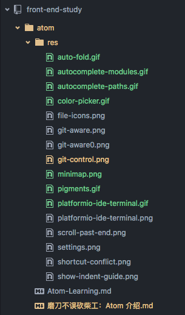

另外，在编辑器的右下角，还能显示你在哪个分支，你添加、删除了多少行。

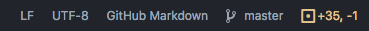

## Command Palette

命令行面板用 cmd + shift + p / ctrl + shift + p 调出，在这个面板中你可以输入命令控制你的编辑器甚至控制你的安装的 package。


## Fuzzy File Finder

按键： cmd + T / ctrl + T，调出查询面板，当项目比较大时，你可以利用这个面板，输入关键字，Atom 便能帮你找到关键字所在的文件。

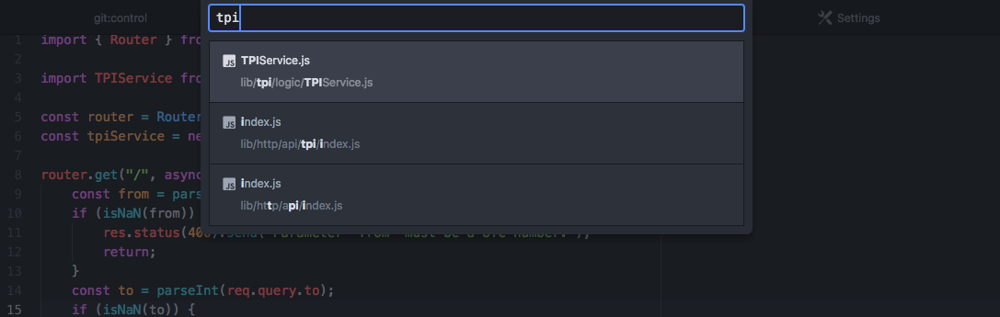

## Atom Shell Commands

在打开这项功能之前，需要先安装 Atom Shell Commands。


安装好了后，就可以在终端（Terminal）中用命令行控制 Atom。比如：

- `atom`： 在当前目录下新建一个新的 Atom 窗口
- `atom .`： 将当前目录在 Atom 中打开
- `atom myProject`： 在 Atom 中打开一个特定的文件夹或文件
- `atom -h`：查看 atom 命令后面可以跟哪些参数


当然你也可以使用 `apm` 命令在终端来安装 package，前提是安装了 [Node](https://nodejs.org/en/)。比如安装一个叫 “pigments” 的 package，那么你可以使用如下命令：

```
apm install pigments
```

这里就插播一句，安装了 Node 后，npm(Node Package Manager) 也一起安装了，通过 `npm` 命令可以安装 Node 的 package。但是速度一般会比较慢，所以我们习惯上会再安装一个 nrm(NPM Registry Manager)，这是一个 npm 注册中心的管理工具，npm 注册中心代表 packages 存放的地方。如果使用默认的注册中心，那么安装时就需要从国外的服务器中下载 package，速度就比较慢，所以我们会利用 nrm 来将国外的注册中心切换至中国的 taobao 注册中心，具体讲是利用如下命令：

```
nrm use taobao
```

检查是否成功切换的标志是输入 `nrm current` 或者 `nrm ls`。然后以后安装 package 时便可以从国内镜像进行下载了。


## Snippets

将你一般比较常写的代码做成模板，方便以后自动填充。

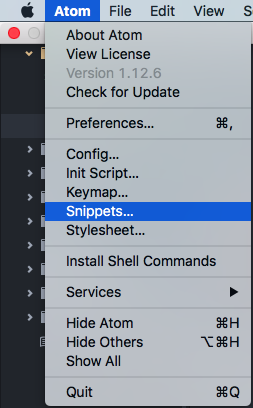

比如我经常需要写 ES6 的类，所以我便将 ES6 类做成模板。


以后，只要我在 JS 文件中输入 `cl` 再按 Enter 键，则会出现：

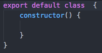

这里解释一下模板的用法，以我上面的模板为例。

- `.source.js`： 目标文件类型，就是模板只有在 JS 文件中自动填充才能生效
- `class`： 模板的名字，仅仅作为你模板的一个标识
- `prefix`： 你在使用时输入的缩略词，这例子中我需要输入 `cl` 来自动补全代码
- `body`： 模板的正文，单行语句只需要 `''`，多行语句则需要 `"""`
- `$1`,`$2`... 光标的位置，按 Tab 或者 Enter 键进入下一个位置

# 定制你的 Atom

下载好对应操作系统的 Atom 并且安装后，首先就是进入设置界面（Windows 下的 Settings 或 Mac 下的 Preferences)。Atom 设置的一个我认为最大的好处就是，她将所有的设置都通过图形化界面来操作，而不像一些编辑器通过一大堆很繁琐的配置文件。你会看到设置界面的导航栏：
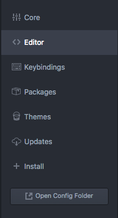

分别是：

- Core：这部分是整个编辑器的核心设置，一般情况下全部默认即可
- Editor： 主要对编辑器的可视化进行设置，一般修改样式即可
- Keybingdings： 编辑器中操作的快捷键
- Packages： Atom 集成了很多的 package ，这是她可以被定制化的一个重要因素。在这里会看到 Atom 装的所有 package
- Themes： Atom 的主题，也可以被定制化
- Updates： 显示需要更新的 package 或者主题
- Install： 在这个界面，我们可以安装各种各样的 package 、主题，这是我们用的最多的一个菜单

## 定制编辑器

Core 部分有一个比较常用，就是 “Ignored Names”。在这里你可以列举不想在左侧文件列表里看到的文件或文件夹，比如 node_modules。

你可以在 Editor 部分设置编辑器的 Font Family, Font Size 等等。我的习惯是这些都默认，除了三个：

- Tab Length： 改成 4，意思是一个 Tab 键占用 4 个空格，默认是 2 个
- Scroll Past End： 选中，意思是你可以将代码的最后一行显示在屏幕的最上方

    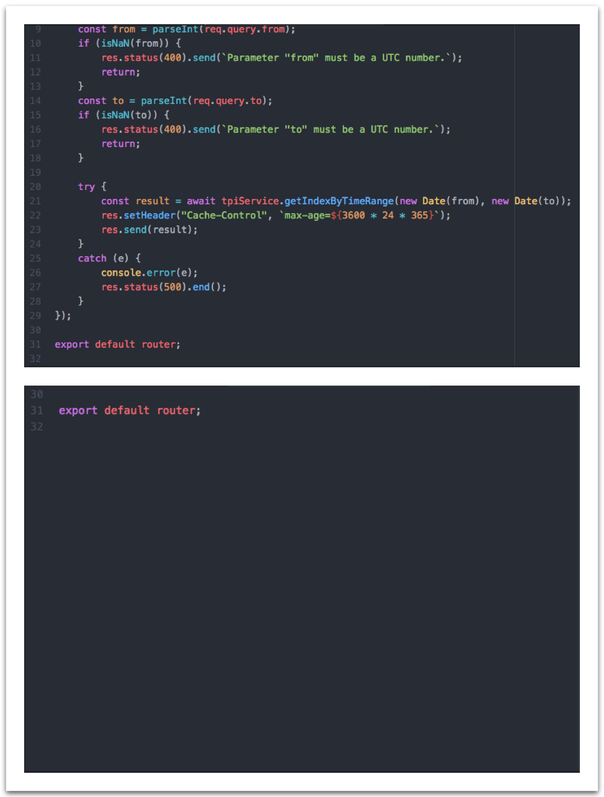

- Show Indent Guide： 选中，可以清晰地标记同一层次的代码，当代码嵌套层次比较复杂时尤其有用

    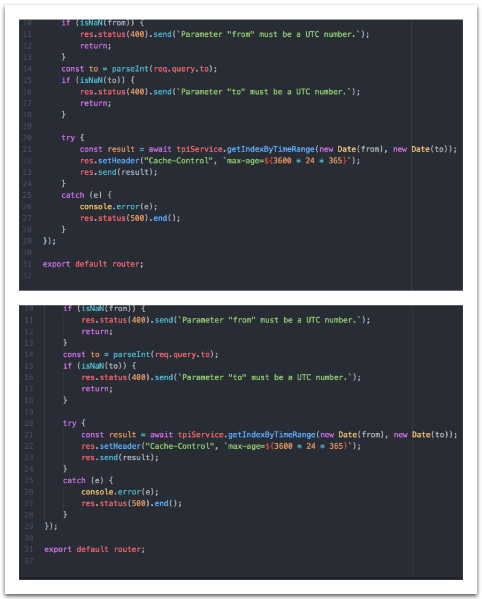

Themes 部分你可以设置编辑器的主题，我采用了默认的主题。如果你不喜欢默认的主题，那你可以去尝试一下其他主题。Atom 自带了几种主题，另外你也可以从网上下载安装，比如 Material Design 风格的。具体安装主题的方法同安装一般的插件包一样，我接下来就重点介绍这一部分。

## 安装 package

Install 部分，我们可以搜索并安装 Atom 的插件包或主题。下面我主要介绍一下我主要使用的 packages（大部分图片来自 package 官网），大家可以根据需要选择，另外，需要提一下的是，大多数的 package 也能进行自定义设置。

- git-control： 这是我最常使用的 package，我可以不用记很多繁琐的 git 命令，常用的命令都能用界面完成，简单便捷，又能减少出错。这个插件的详细使用请参加[版本配置工具：Git 与 Github]()

    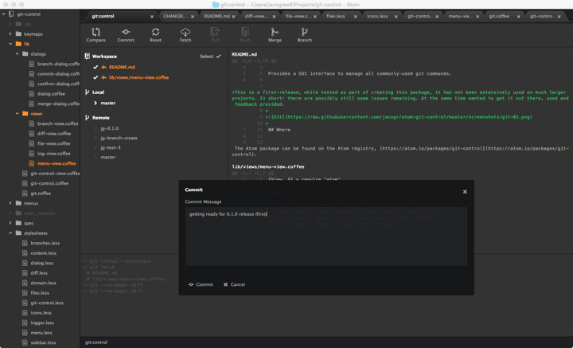

- platformio-ide-terminal： 可以在 Atom 中直接打开终端

    

- autocomplete-paths： 自动补全路径

    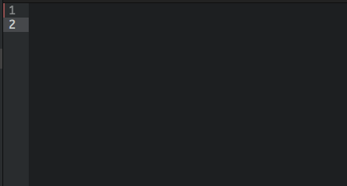

- autocomplete-modules： 自动补全模块名

    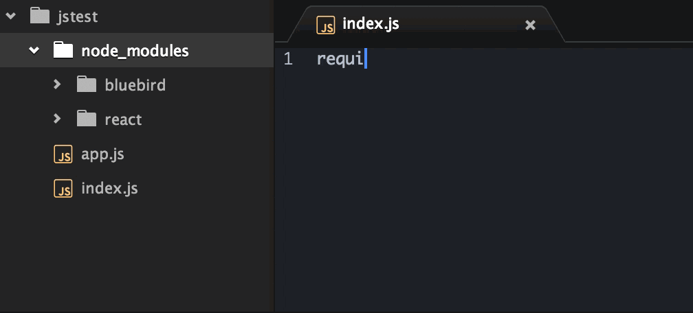

- auto-fold： 可以折叠代码

    

- file-icons： 根据文件类型显示不同的图标

    

- pigments：显示颜色

    

- color-picker： 以可视化的方式编辑颜色

    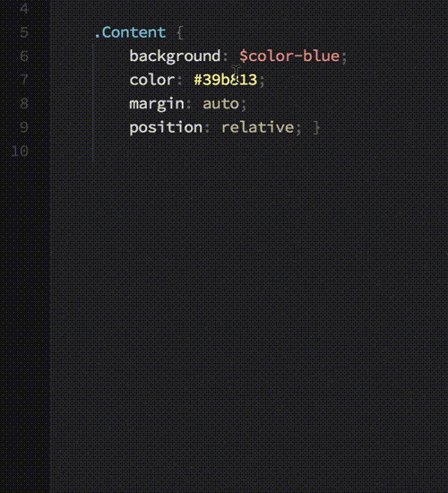

- minimap：显示代码的缩略图，用过 sublime 的小伙伴会比较熟悉

    

- ask-stack：当你有什么技术问题，你几乎都可以在 [stackoverflow](http://stackoverflow.com/) 上找到，而这个插件就是让你不用离开 Atom 就可以使用 stackoverflow

    

- project-manager：更好地管理你的项目

    

- javascript-snippet：高频语句的自动填充，是对 Atom 自带的 snippets 的一个拓展

    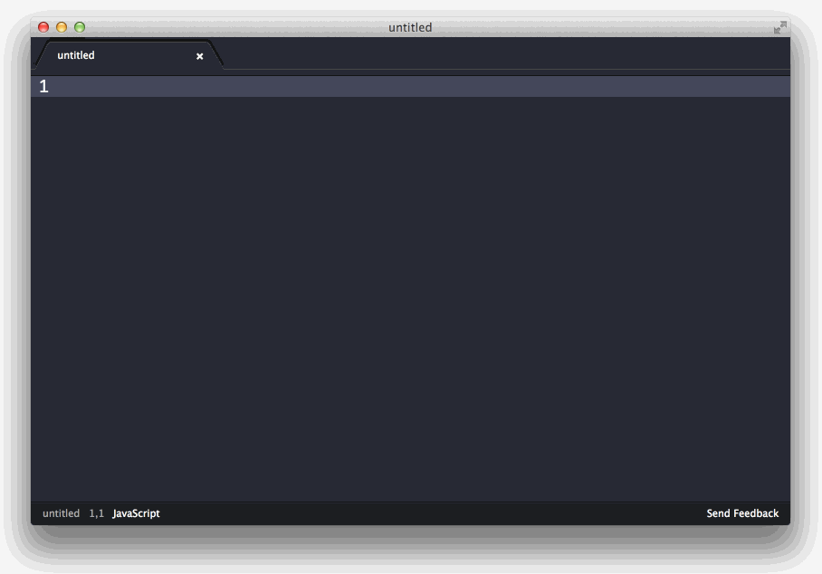

- editorconfig：自动对不同的项目配置不同的代码风格

    

- emmet： 写 HTML 的利器，根据特定语法快速生成 HTML
- language-babel： 支持 ES2015、JSX 等语法高亮

### 迁移

当换了一台电脑，那如何迁移现在这台上安装的包呢？可以使用：`apm list --installed --bare > package-list.txt` 生成一个包含安装包信息的文件，再在目标电脑上键入 `apm install --packages-file package-list.txt` 就可以等待 Atom 自己安装啦。


# 便捷的操作

下面列举一些我常用的快捷操作，这些操作很大程度上帮助我提升了效率。部分内容会与上面的 Atom 特色重复。

- 拖动一个文件夹到 Atom 窗口或者 Atom 应用图标，便能在 Atom 中打开这个文件夹
- 拖动一个文件到 Atom 窗口或者 Atom 应用图标，便在 Atom 中打开这个文件所在的文件夹
- cmd + T / ctrl + T： 全局关键词快速模糊搜索
- 选中项目根目录，右键，选择 “Search in Directory”，可以全局准确搜索关键字
- cmd + F / ctrl + F： 文件中关键词搜索及替换
- 选择多项：按住 cmd / ctrl，用鼠标点击另外一处你想选择的地方，这样，你就可以看到多个一起闪动的光标

# Atom -- 常见问题解决

## 快捷键冲突

1. 打开 设置 -> Keybingdings；
2. 复制目标快捷键的配置信息，如下图所示，目标是将 `ctrl + alt + o` 快捷键配置为打开或关闭 `git-control`；

    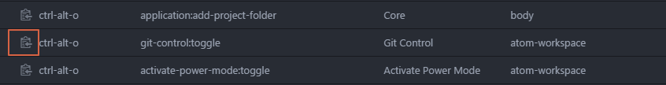

3. 打开 "keymap.cson"(ctrl + shift + p / cmd + shift + p, type "open keymap")；
4. 粘贴配置信息至文件末尾。

## 隐藏特定文件或文件夹

我们在 Core 的 Ignored Names 中添加的文件或文件夹并不会在左侧文件栏中隐藏，需要我们额外设置。

1. 打开 设置 -> Packages；
2. 找到 tree-view；
3. 勾选 "Hide Ignored Names"，搞定。

以上是我在实际中对 Atom 的使用，如果你在实践中有其他更酷炫更有效的操作、package，记得 fork + pull request / 留言，如果你在使用中遇到了问题，也欢迎 fork + pull request / 留言。
