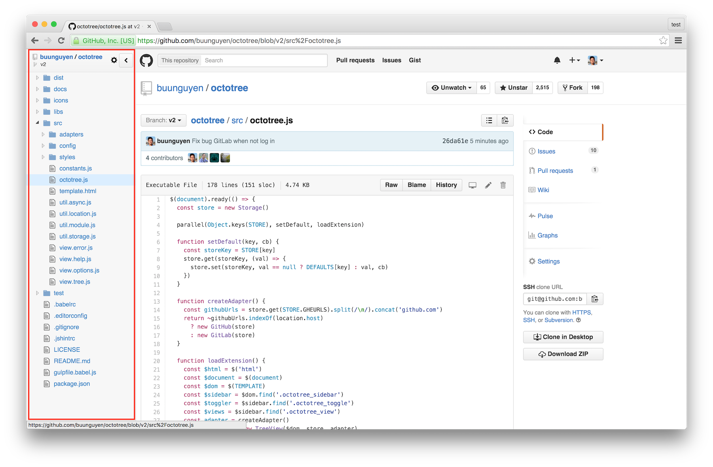
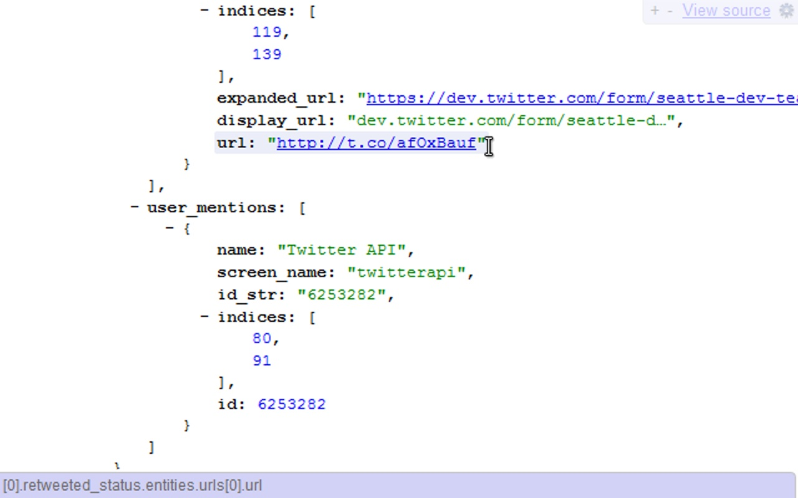
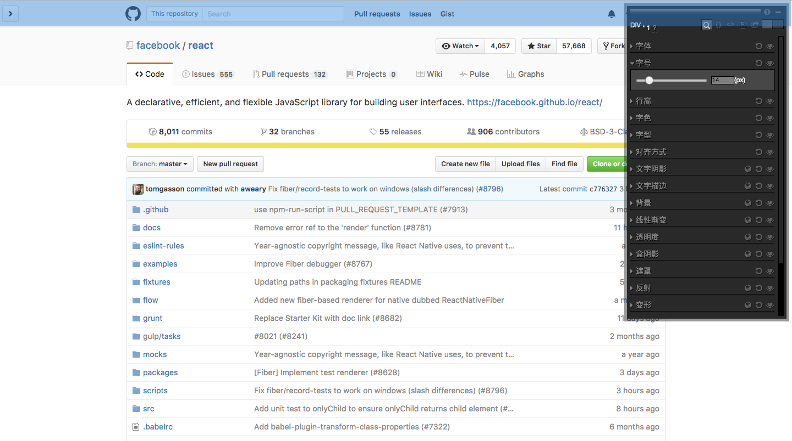
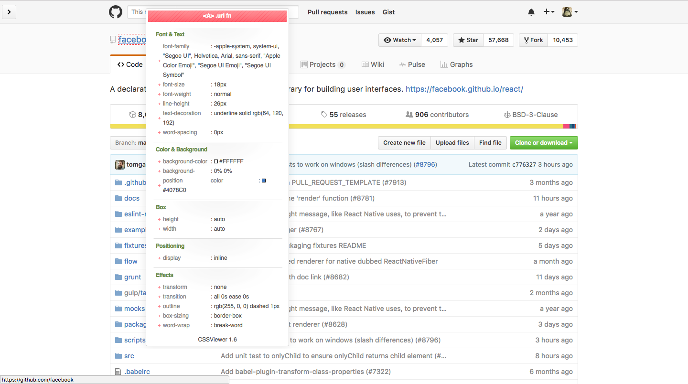
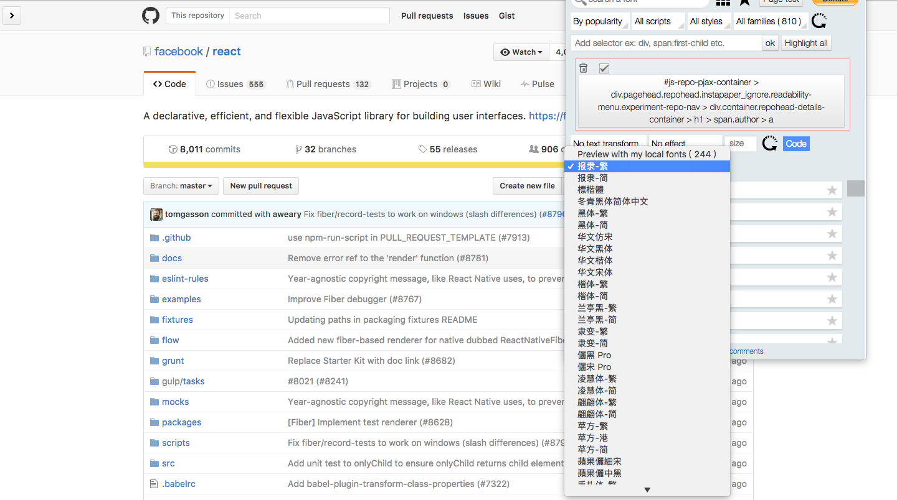
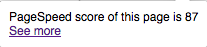

# 推荐给开发者的 Chrome extensions/apps

在文章开头，需要普及一下几个概念，那就是 Chrome 中的 extension、app 和 plugin，分别是扩展、应用和插件的意思，不能混为一谈。

- extension(拓展)：在 Chrome 地址栏输入 [chrome://extensions](chrome://extensions) 打开。Chrome 拓展是指可以增加 Chrome 浏览器功能或性能的小程序。“拓展”经常会被大家说成是“插件”
- app(应用)：Chrome 地址栏输入 [chrome://apps](chrome://apps) 打开。利用网页技术实现与本地桌面程序一样的应用程序。不过除了 Chrome OS，Google 将不再为 Windows、Mac、Linux 提供 App 支持，并且建议我们利用 [PWA](https://developers.google.com/web/progressive-web-apps/) 技术创建 Web app，或者改成写拓展，或者利用 [Electron](https://github.com/electron/electron) 或者 [nw](https://github.com/nwjs/nw.js) 创建本地应用
- plugin(插件)：Chrome 地址栏输入 [chrome://plugins](chrome://plugins) 打开。这才是 Chrome 的“插件”，这是对浏览器本身功能的增强。比如 "Chrome PDF Viewer" 插件可以使得浏览器具有浏览 PDF 文件的能力。

平时我们不用关心插件，我们经常用到的是“拓展”，并且偶尔也会使用到“应用”。所以今天主要就介绍几款 Chrome 拓展和应用。

## Extensions(拓展)

对于开发者来说，Chrome 不仅自身厉害（可以参见[Chrome DevTools](../devtools/Chrome DevTools Overview.md)）,而且背后还有强大的社区，今天就跟大家整理一下 Chrome 中那些针对开发者的拓展及应用。

### [octotree](https://chrome.google.com/webstore/detail/octotree/bkhaagjahfmjljalopjnoealnfndnagc)

当你查看 Github 文件时你有没有因为不停切换文件而感到烦扰？octotree 能够将一个 Repository 以文件数的形式展现。

### [JSONView](https://chrome.google.com/webstore/detail/jsonview/chklaanhfefbnpoihckbnefhakgolnmc)

将你的 JSON 数据更好地展现出来。

### [Code Cola](https://chrome.google.com/webstore/detail/code-cola/lomkpheldlbkkfiifcbfifipaofnmnkn)

以可视化方式在线编辑页面样式。

### [CSSViewer](https://chrome.google.com/webstore/detail/cssviewer/ggfgijbpiheegefliciemofobhmofgce)

查看页面任意一个元素的 CSS 样式。

### [Font Playground](https://chrome.google.com/webstore/detail/font-playground/hdpmpnhaoddjelneingmbnhaibbmjgno)

以可视化的方式为页面选中的元素设置不同的字体。

### [Google PageSpeed Insights Extension](https://chrome.google.com/webstore/detail/google-pagespeed-insights/edbkhhpodjkbgenodomhfoldapghpddk)

原理同将网址放入到 [PageSpeed Insights](https://developers.google.com/speed/pagespeed/insights/) 中，来测试网页的加载速度。这个插件可以一键为网页加载速度打分，并且可以为你链接到 [PageSpeed Insights](https://developers.google.com/speed/pagespeed/insights/)。

## Apps(应用)

在介绍开发者用的 Apps 之前，我想先介绍一款拓展：[远方 New Tab](https://chrome.google.com/webstore/detail/dream-afar-new-tab/henmfoppjjkcencpbjaigfahdjlgpegn)，与大家熟悉的 [Momentum](https://chrome.google.com/webstore/detail/momentum/laookkfknpbbblfpciffpaejjkokdgca) 相似，但我觉得这款拓展更适合我，不仅因为新的 Tab 页面上保留了 Google 原来的搜索框，也添加的几个有用的菜单：History、Bookmarks 和 Apps。所以我平时打开 Chrome apps 的入口都在这个页面。可能有人觉得搜索框影响图片的展现，你还可以将搜索框设置成隐藏，当鼠标悬浮到相应位置时，搜索框也能自动出现。

介绍了这款能够快速打开 Chrome apps 的拓展后，我们来看看有哪些适合开发者使用的应用。
