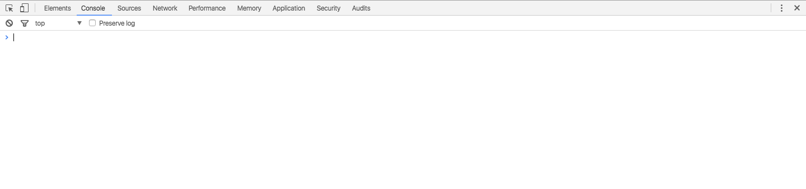

Chrome DevTools（Chrome 开发者工具） 是内嵌在 Chrome 浏览器里的一组用于网页制作和调试的工具。官网还推荐一款叫做 [Chrome 金丝雀版本（Chrome Canary）](https://www.google.com/intl/en/chrome/browser/canary.html)的 Chrome 浏览器，从这里你可以获得最新版本的 DevTools。为什么 Google 称之为金丝雀呢，因为金丝雀早期在矿井中被用来预警，而该版本的 Chrome 一定程度上也能起到该作用。不用担心 Chrome Canary 会覆盖原本的 Chrome，从 Logo 就可以看出这是两个软件。

## 访问 DevTools

可以通过以下这些方式打开 Chrome DevTools：

- 选择右上角Chrome 菜单，然后选择更多工具 -> 开发者工具
- 右键，选择检查/审查元素

当然，比较推荐利用快捷键来打开：

- `Ctrl + Shift + I, F12 / Cmd + Opt + I`，打开 DevTools
- `Ctrl + Shift + J / Cmd + Opt + J`，打开 DevTools，并且定位到控制台面板

上面两种方式不仅可以打开 DevTools，还可以关闭 DevTools。当然，还有一种方式可以打开 DevTools。

- `Ctrl + Shift + C / Cmd + Opt + C`，打开 DevTools，并且开启审查元素模式（相当于点击了 DevTools 左上角的图标： ）

说到快捷键，这里再跟大家介绍几个非常有用的：

- `F5, Ctrl + R / Cmd + R`，刷新页面
- `Ctrl + F5, Ctrl + Shift + R / Cmd + Shift + R`，刷新页面并忽略缓存
- `Ctrl + '+' / Cmd + Shift + '+'`，放大 DevTools
- `Ctrl + '-' / Cmd + Shift + '-'`，缩小 DevTools
- `Ctrl + 0 / Cmd + 0`，DevTools 恢复大小

当然，DevTools 里不仅仅这些有用的快捷键，下面在介绍到具体的场景时再介绍。

## DevTools 窗口

（图片来自于 Chrome v57.0 截图）

DevTools 是很多功能的集合，而在窗口顶部的工具栏是对这些功能的分组。最新的 Chrome 主要有 9 个功能组，分别对应了 9 个面板：

- Elements：在 Elements 面板中可以通过 DOM 树的形式查看所有页面元素，同时也能对这些页面元素进行所见即所得的编辑
- Console：一方面用来记录页面在执行过程中的信息（一般通过[各种 console 语句](../../js/console/JavaScript 中的 console.md)来实现），另一方面用来当做 shell 窗口来执行脚本以及与页面文档、DevTools等进行交互
- Sources：Sources 面板主要用来调试页面中的 JavaScript
- Network：在 Network 面板中可以查看通过网络来请求来的资源的详细信息以及请求这些资源的耗时
- Performance：在 Performance 面板可以查看页面加载过程中的详细信息，比如在什么时间开始做什么事情，耗时多久等等。有人会问，这个跟上面的 Network 有什么区别呢，上面也能显示耗时信息。在 Performance 面板中，你不仅可以看到通过网络加载资源的信息，还能看到解析 JS、计算样式、重绘等页面加载的方方面面的信息
- Memory：Memory 面板主要显示页面 JS 对象和相关联的 DOM 节点的内存分布情况
- Application：记录网页加载的所有资源，包括存储信息、缓存信息以及页面用到的图片、字体、脚本、样式等信息
- Security：用于检测当面页面的安全性
- Audits：审计面板会对页面的加载进行分析，然后给出提高页面性能的建议，官网建议查看 [PageSpeed Insights](https://developers.google.com/speed/pagespeed/insights/) 来获得更多的页面加载建议。

细心的同学一定发现了我们现在使用的 Chrome 上面没有 Performance 和 Memory，而是 Timeline 和 Profiles，是不是我写错了呢？不是的，而是 Chrome 到 v57 后，便将 Timeline 更名为 Performance，将 Profiles 更名为 Memory。目前来看，Google 仅仅是更名以及调整了部分功能所属的面板而已，并没有功能上的增删，这个会在下面介绍各个面板时详细介绍。
