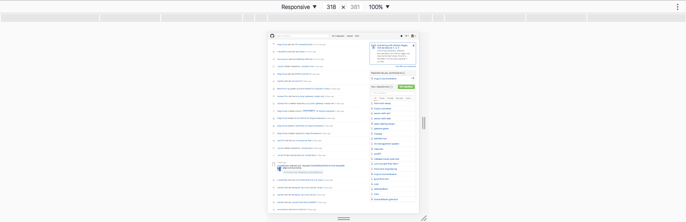
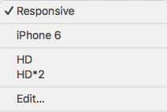
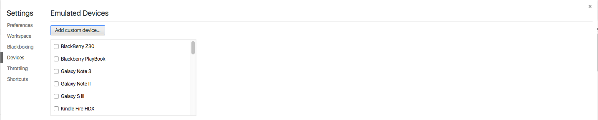
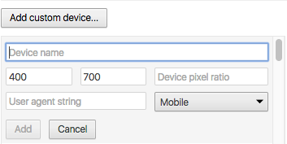

Chrome DevTools（Chrome 开发者工具） 是内嵌在 Chrome 浏览器里的一组用于网页制作和调试的工具。官网还推荐一款叫做 [Chrome 金丝雀版本（Chrome Canary）](https://www.google.com/intl/en/chrome/browser/canary.html)的 Chrome 浏览器，从这里你可以获得最新版本的 DevTools。为什么 Google 称之为金丝雀呢，因为金丝雀早期在矿井中被用来预警，而该版本的 Chrome 一定程度上也能起到该作用。不用担心 Chrome Canary 会覆盖原本的 Chrome，从 Logo 就可以看出这是两个软件。本文的实操性很强，建议大家在阅读时进行尝试，以加深印象。另外，需要注意一下的是，本文不是对 [DevTools 官方文档](https://developer.chrome.com/devtools)的翻译，只是对我们实际使用中经常使用到的有用的功能进行整理。

## 访问 DevTools

可以通过以下这些方式打开 Chrome DevTools：

- 选择右上角Chrome 菜单，然后选择更多工具 -> 开发者工具
- 右键，选择检查/审查元素

当然，比较推荐利用快捷键来打开：

- `Ctrl + Shift + I, F12 / Cmd + Opt + I`，打开 DevTools
- `Ctrl + Shift + J / Cmd + Opt + J`，打开 DevTools，并且定位到控制台面板

上面两种方式不仅可以打开 DevTools，还可以关闭 DevTools。当然，还有一种方式可以打开 DevTools。

- `Ctrl + Shift + C / Cmd + Opt + C`，打开 DevTools，并且开启审查元素模式（相当于点击了 DevTools 左上角的图标： ）

说到快捷键，这里再跟大家介绍几个非常有用的：

- `F5, Ctrl + R / Cmd + R`，刷新页面
- `Ctrl + F5, Ctrl + Shift + R / Cmd + Shift + R`，刷新页面并忽略缓存
- `Ctrl + '+' / Cmd + Shift + '+'`，放大 DevTools
- `Ctrl + '-' / Cmd + Shift + '-'`，缩小 DevTools
- `Ctrl + 0 / Cmd + 0`，DevTools 恢复大小

当然，DevTools 里不仅仅这些有用的快捷键，下面在介绍到具体的场景时再介绍。

## DevTools 窗口

（图片来自于 Chrome v57.0 截图）

DevTools 是很多功能的集合，而在窗口顶部的工具栏是对这些功能的分组。最新的 Chrome 主要有 9 个功能组，分别对应了 9 个面板：

- **Elements**：在 Elements 面板中可以通过 DOM 树的形式查看所有页面元素，同时也能对这些页面元素进行所见即所得的编辑
- **Console**：一方面用来记录页面在执行过程中的信息（一般通过[各种 console 语句](../../js/console/JavaScript 中的 console.md)来实现），另一方面用来当做 shell 窗口来执行脚本以及与页面文档、DevTools等进行交互
- **Sources**：Sources 面板主要用来调试页面中的 JavaScript
- **Network**：在 Network 面板中可以查看通过网络来请求来的资源的详细信息以及请求这些资源的耗时
- **Performance**：在 Performance 面板可以查看页面加载过程中的详细信息，比如在什么时间开始做什么事情，耗时多久等等。有人会问，这个跟上面的 Network 有什么区别呢，上面也能显示耗时信息。在 Performance 面板中，你不仅可以看到通过网络加载资源的信息，还能看到解析 JS、计算样式、重绘等页面加载的方方面面的信息
- **Memory**：Memory 面板主要显示页面 JS 对象和相关联的 DOM 节点的内存分布情况
- **Application**：记录网页加载的所有资源，包括存储信息、缓存信息以及页面用到的图片、字体、脚本、样式等信息
- **Security**：用于检测当面页面的安全性
- **Audits**：审计面板会对页面的加载进行分析，然后给出提高页面性能的建议，官网建议查看 [PageSpeed Insights](https://developers.google.com/speed/pagespeed/insights/) 来获得更多的页面加载建议。

细心的同学一定发现了我们现在使用的 Chrome 上面没有 Performance 和 Memory，而是 Timeline 和 Profiles，是不是我写错了呢？不是的，而是 Chrome 到 v57 后，便将 Timeline 更名为 Performance，将 Profiles 更名为 Memory。目前来看，Google 仅仅是更名以及调整了部分功能所属的面板而已，并没有功能上的增删，这个会在下面介绍各个面板时详细介绍。

除了 9 个功能面板，工具栏还有 3 个选项，分别是左侧的 、 和右侧的  ，分别表示检查元素、设备切换以及 DevTools 的定制化面板。检查元素后面在介绍 Elements 时会提到；设备切换是我们比较常用的功能，能够将你的浏览器模拟成一个带触屏功能的移动设备；DevTools 定制化面板是对 DevTools 本身的定制与控制。下面着重介绍下“切换设备”这一功能。

### 切换设备

使用这个功能能够将你的浏览器变成任意一款移动设备，也能为你的网页设定宽高，这在做单页应用时非常有用。现在选中“切换设备”选项，图标由黑色变成蓝色，整个浏览器内容窗口变成上下两部分，上面是选项，下面是网页内容：

上面有 4 个部分组成，第一个是设置设备类型，第二个代表下面网页的宽和高，第三个代表缩放比例，第四个代表旋转设备甚至选择设备的状态（需要设备支持，比如选择Nexus 5X 时）。我们着重看第一个。

点击第一个下拉框，出现： ，你们会发现有几条分割线，先说浏览器默认的，有两条分割线，将所有选项分成 3 个部分，分别是

- Responsive，代表响应式，即你可以随意的拖动改变网页的宽高
- 常见移动设备，比如 Galaxy S5 / iPhone 6 / iPad 等，选择一项后，就能将浏览器模拟成那个设备的大小、User Agent 等行为
- edit，编辑，选中之后出现如下界面：
    

    这个界面也可以通过  -> Settings -> Devices 来打开。在这个界面上，你可以选择你经常需要使用的设备，当然也可以定制你自己的设备。

    

    分别输入设备名称、设备宽高、[DPR（默认是 1，可不填）](https://developers.google.com/web/tools/chrome-devtools/device-mode/emulate-mobile-viewports#device_pixel_ratio_dpr)、[User-agent（用户代理，可不填）](https://developers.google.com/web/tools/chrome-devtools/device-mode/emulate-mobile-viewports#user_agent_type)，选择屏幕类型，最后点击 "Add"，便可以将你的设备加到设备列表里了。这里再多说一下屏幕类型：

    - Mobile：可触屏的移动设备，鼠标指针是粗黑的点，代表手指与屏幕的触点
    - Mobile(no touch)：不可触屏的移动设备
    - Desktop：一般指 PC 上的网页，鼠标指针与普通 PC 网页类似
    - Desktop(touch)：带触屏的 PC 上的网页

    所有大家看到鼠标指针是个粗黑的点时不要觉得奇怪，那只是代表你现在在操控一台移动设备。

当你将你自定义的设备添加进设备列表时，DevTools 会自动选中，从而可以在下拉框中看到第四部分：

- 自定义的设备

那我的设备举例： ，我一般不怎么用到移动设备，所以我就保留了一个 iPhone 6，另外我还需要一个 1920 * 1080 的高清屏，所以我以 HD 命名，定义了一个 1920 * 1080 的设备。

上面大概介绍了 DevTools 的几个面板和另外 3 个功能选项的作用，着重介绍了切换设备的功能，下面我们一起来看一下如何使用每一个面板。

## 详细介绍

下面的例子没有特殊说明均拿 [Github](https://github.com/) 进行举例。

### Elements

[Elements](./Elements.md)

### Console

[Console](./Console.md)

### Sources

[Sources（待写）](./Sources.md)

### Network

[Network（待写）](./Network.md)

### Performance

[Performance（待写）](./Performance.md)

### Memory

[Memory（待写）](./Memory.md)

### Application

[Application（待写）](./Application.md)

### Security

[Security（待写）](./Security.md)

### Audits

[Audits（待写）](./Audits.md)
