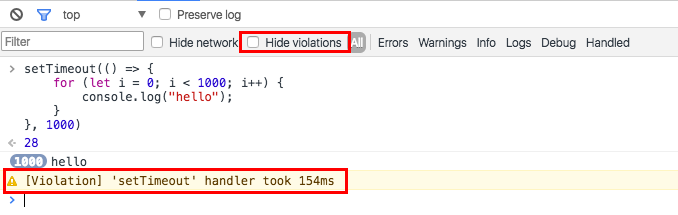
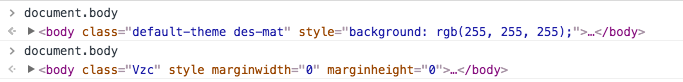
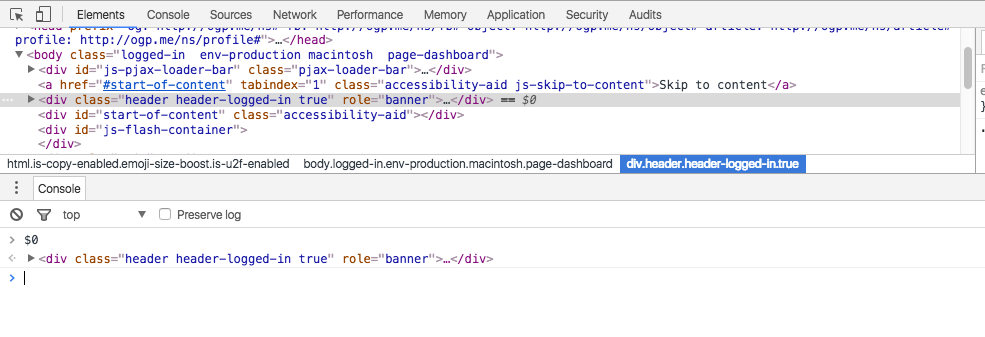
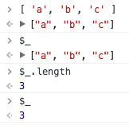
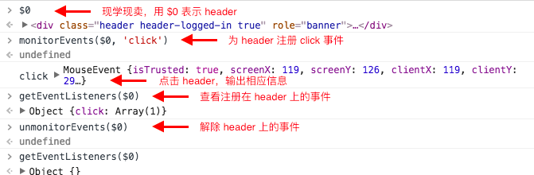

Chrome DevTools 的 Console 主要提供两类功能：

- 在开发过程中记录代码诊断信息
- 与文档和 DevTools 交互的命令行工具

## 打开 Console

首先，先提一下打开 Console 的方法。第一种是之前提到过的：`Ctrl + Shift + J / Cmd + Opt + J`，打开 DevTools，并且直接定位到控制台面板。另外一种比较特殊，如果你想打开其他功能面板的同时，还想打开 Console 的话，那么可以将 Console 以 "Drawer" 的形式打开：


打开的方式有 2 种：

- 按 esc 键
- 点击 DevTools 右上角的  ，再选择 "Show console drawer"

关掉的方法一样。

## 聊聊 Console 中的几个菜单

我们先看一下 Console 的界面，看看这个曾经很熟悉的界面是否真的熟悉。


上下结构，上面是功能按钮或选项，下面是信息展示或交互的面板。先看上面，从左往右，依次是：

- 清空 Console
- 过滤 Console 中的信息
- 执行环境选择器
- 当刷新页面时是否保存现有的 Console 中的信息
- 有的时候，还有 "Show all messages"，显示所有信息

### 清空

这个很好理解，就是让你的 Console 面板变得干净。但需要注意的是，这个清空并不是真正意义的清空，你还可以按向上向下的按键查看在 Console 中输入的历史。另外，还有很多种清空 Console 的办法，键盘党可以用 `Ctrl + L / Cmd + K`（Mac 都支持） 来实现。

### 过滤


首先需要说明一下的是，过滤的对象是输出的内容，即不会对输入的命令进行过滤。下面对几个过滤条件简单说明下：

- Hide network：默认的，Console 会报告网络问题，勾选这个功能就能过滤网络报告信息
- Hide violations：violations 是最新的 DevTools 新加的一个功能，意在显示那些阻塞 UI 的长时间任务。举个例子：

    

- Error：只显示由 `console.error()` 输出的结果
- Warning：只显示由 `console.warn()` 输出的结果
- Info：只显示由 `console.info()` 输出的结果
- Logs：只显示由 `console.log()` 输出的结果
- Debug：只显示由 `console.timeEnd()` 和 `console.debug()` 输出的结果
- Handled：这个要多说一点，毕竟是新东西。

    考察这句代码：

    ```javascript
    var p = new Promise((resolve, reject) => reject('ooops'));
    ```

    放在 Console 中执行，输出的是个 error 类型的错误。如图所示：

    

    接着输入下一句代码：

    ```javascript
    p.catch(e => {});
    ```

    结果如图所示：

    

    此时，你会发现刚刚的 Error 类型的错误发生了变化，变成了 Handled 类型，可以通过选择过滤类型来判断。

- All： 显示所有 log 信息

当然你还可以按住 Ctrl / Cmd 的同时，多选不同 console 类型的输出。

如果你不清楚上面一堆 console 方法，那么你可以参考我的另一篇博客：[JavaScript 中的 console](../../js/console/JavaScript 中的 console.md)

### 执行环境

除了当前的页面的执行环境，其他的框架、拓展都有其自己的执行环境。什么意思？举例子来说吧。利用 Chrome 浏览器打开一个 Google 首页，你会发现默认的执行环境是 "top"，点击下拉框，你会发现还有其他选项，我们暂时就保持默认的 top 即可。在 Console 中输入 `document.body`，回车，再将执行环境切换成 "iframe"，再输入 `document.body`，回车，执行结果如下：



你会发现，同样的命令，返回不一样的结果，原因就是执行环境发生了改变。

不过，我们一般极少用到这个功能，所以在这里不做多详细说明。

### Preserve log

默认是不勾选的，所以当刷新页面时，Console 中的信息会被清空掉。如果勾选了的话，那么刷新页面之后，信息还会被保留。

## Console 能干什么事

### 执行表达式

你可以输入任何表达式，按回车执行。在输入过程中，可能会出现智能提醒，你可以按 tab 或者 → 键来完成自动补全。另外，还可以按 ↑ 和 ↓ 键来翻阅历史表达式


## Chrome DevTools 自带了哪些有用的表达式

下面描述的都是 Chrome DevTools 自带的方法或者变量，需要注意一下的是，当页面暴露相同的方法或变量的话，DevTools 自带的会被覆盖，比如 jQuery 官网下的 Console 中的 $() 就是自己的方法。

### 选择元素

- $()：是 `document.querySelector()` 的缩写
- $$()：是 `document.querySelectorAll()` 的缩写
- $x()：通过 XPath 的方式查看元素，注意是 "XPath" 中的 "x"，而不是 `+-*/` 中的 `*`

### inspect

在 Console 中输入 `inspect()` 参数是 DOM 元素或者 JS 引用，可以跳转到 Elements 面板并且定位到你选择的那个 DOM 节点那。

### $0-4

$0， $1...$4，代表 5 个最近访问过的 DOM 或者堆对象（Heap Object），$0 是最近访问的。那访问的意思是什么？就是在 Elements 面板被审查或者在 Memory 面板被选择的 DOM 元素或者堆对象。



上面的例子中，我最后一次审查（点击）了 `<div class="header">***</div>` 的节点，所以 $0 就输出了这个节点。

### $_

`$_` 返回上一次表达式执行的结果。举个栗子：



### Event

在 Chrome DevTools 里你可以给 DOM 绑定事件、解绑事件，也能查看 DOM 注册了哪些事件

- `monitorEvents(DOM_element, event)`，如果 event 为空的话，那会给选定的 DOM 元素加上所有事件
- `unmonitorEvents(DOM_element)`，为某个 DOM 元素解绑事件
- `getEventListeners(DOM_element)`，查看某个 DOM 元素绑定了哪些事件



上面的例子中，我为 Github 的 header 注册了一个 click 事件，最后又解绑了事件。
