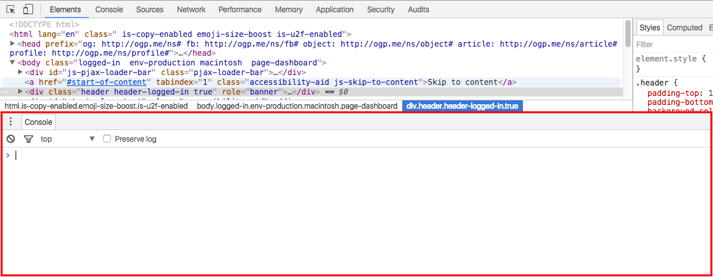
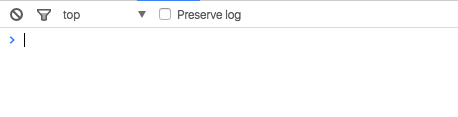
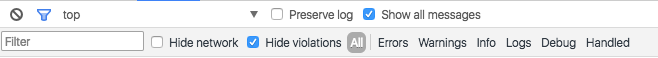
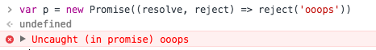
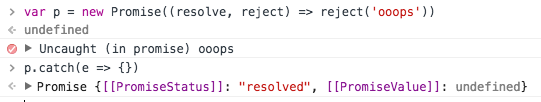

Chrome DevTools 的 Console 主要提供两类功能：

- 在开发过程中记录代码诊断信息
- 与文档和 DevTools 交互的命令行工具

## 打开 Console

首先，先提一下打开 Console 的方法。第一种是之前提到过的：`Ctrl + Shift + J / Cmd + Opt + J`，打开 DevTools，并且直接定位到控制台面板。另外一种比较特殊，如果你想打开其他功能面板的同时，还想打开 Console 的话，那么可以将 Console 以 "Drawer" 的形式打开：



打开的方式有 2 种：

- 按 esc 键
- 点击 DevTools 右上角的  ，再选择 "Show console drawer"

关掉的方法一样。

## 聊聊 Console 中的几个菜单

我们先看一下 Console 的界面，看看这个曾经很熟悉的界面是否真的熟悉。



上下结构，上面是功能按钮或选项，下面是信息展示或交互的面板。先看上面，从左往右，依次是：

- 清空 Console
- 过滤 Console 中的信息
- 执行环境选择器
- 当刷新页面时是否保存现有的 Console 中的信息
- 有的时候，还有 "Show all messages"，显示所有信息

### 清空

这个很好理解，就是让你的 Console 面板变得干净。但需要注意的是，这个清空并不是真正意义的清空，你还可以按向上向下的按键查看在 Console 中输入的历史。另外，还有很多种清空 Console 的办法，键盘党可以用 `Ctrl + L / Cmd + K`（Mac 都支持） 来实现。

### 过滤



首先需要说明一下的是，过滤的对象是输出的内容，即不会对输入的命令进行过滤。下面对几个过滤条件简单说明下：

- Hide network：默认的，Console 会报告网络问题，勾选这个功能就能过滤网络报告信息
- Hide violations
- Error：只显示由 `console.error()` 输出的结果
- Warning：只显示由 `console.warn()` 输出的结果
- Info：只显示由 `console.info()` 输出的结果
- Logs：只显示由 `console.log()` 输出的结果
- Debug：只显示由 `console.timeEnd()` 和 `console.debug()` 输出的结果
- Handled：这个要多说一点，毕竟是新东西。

    考察这句代码：

    ```javascript
    var p = new Promise((resolve, reject) => reject('ooops'));
    ```

    放在 Console 中执行，输出的是个 error 类型的错误。如图所示：

    

    接着输入下一句代码：

    ```javascript
    p.catch(e => {});
    ```

    结果如图所示：

    

    此时，你会发现刚刚的 Error 类型的错误发生了变化，变成了 Handled 类型，可以通过选择过滤类型来判断。

- All： 显示所有 log 信息

当然你还可以按住 Ctrl / Cmd 的同时，多选不同 console 类型的输出。

如果你不清楚上面一堆 console 方法，那么你可以参考我的另一篇博客：[JavaScript 中的 console](../../js/console/JavaScript 中的 console.md)
