Elements 面板主要用于对页面 HTML 和 CSS 的检查以及可视化编辑。

这是我的 Github 首页的 Elements 面板：

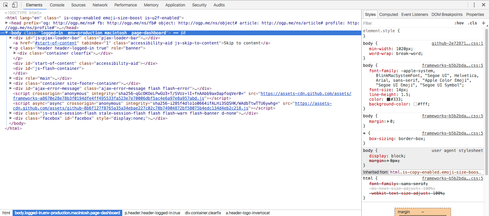

可以看到整个面板被分成 3 个部分，左上是一棵 DOM 数，左下是选中元素的所有父节点，右边是选中元素的样式。左下的部分比较简单，不做详细说明。

## DOM 树

### 检查页面元素

- 右击页面任意一处，选择检查 / 审查元素，查看选中页面对应的 DOM 元素
- 点击 ，当图标显示为蓝色时，鼠标点击页面任意一处，可以查看选中页面对应的 DOM 元素
- 鼠标悬停 DOM 树上的任意一个节点，页面会用淡蓝色的蒙板在页面上标记 DOM 节点对应的页面
- 按键盘的向上向下键可以在展开的节点之间进行切换，向左向右键可以收缩和展开节点

### 编辑 DOM

你可以任意修改 DOM 树上的任意信息，比如修改节点的类型、属性，或者改变 DOM 节点的所属关系等等。不过需要注意的是，这些修改都是临时的，不会得到保存，当刷新页面时所有修改都将重置。

- 双击元素标签，修改 DOM 节点类型，比如将 div 改成 ul
- 双击元素属性，修改 DOM 节点属性，比如修改节点的 id
- 选择一个 DOM 节点，按 enter 键，然后按 tab 键选择想修改的属性或标签
- 选择一个 DOM 节点，并将其拖到目标位置，可以改变页面元素的结构
- 选择一个 DOM 节点，按 delete 键删除
- Ctrl + Z / Cmd + Z，撤回操作

这 6 个是比较常见的操作，操作起来也是直截了当，更多的操作可以通过选中一个 DOM 节点，再右击进行查看：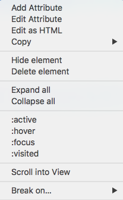

- Add Attribute：为选中节点添加一个属性
- Edit Attribute：修改选中节点中选中属性
- Edit as HTML：将选中节点当做 HTML 进行编辑
- 复制选中的节点，可以复制选中节点的选择器、XPath、元素本身、outerHTML 等，也能剪切、粘贴节点，我们一般选择复制节点的选择器
- Hide element：隐藏节点
- Delete element：删除节点
- Expand all：展开所选节点下的所有子节点
- Collapse all：收缩所选节点下的所有子节点，包括自己
- 4 个伪类：选中则表示所选节点处于相应的状态，比如选中 `:hover` 则表示所选节点当前正处于鼠标悬停的状态
- Scroll into View：如果所选的 DOM 节点对应的页面元素不在可视区域内的话，点击这个选项则会将页面滚动到可以显示对应的页面元素的位置
- Break on：给 DOM 节点设置断点，主要用来调试 JavaScript 代码，这段代码的作用是用来修改所加断点的 DOM 节点，这一般用在比较复杂的网页应用当中。可以给所选的 DOM 节点添加 3 种类型的断点：
    - subtree modifications：所选节点的子节点被添加、删除、移动的话，则会触发
    - attribute modifications：所选节点的属性被修改的话，则会触发
    - node removal：所选节点被删除的话，则会触发

    这 3 种断点可以同时作用在一个节点上。为了便于大家理解，我们举个例子。拿 jQuery 官网举例（主要在 Console 里可以使用 jQuery）：
    我给 header 节点加一个 "attribute modifications" 的断点，如下图所示：

    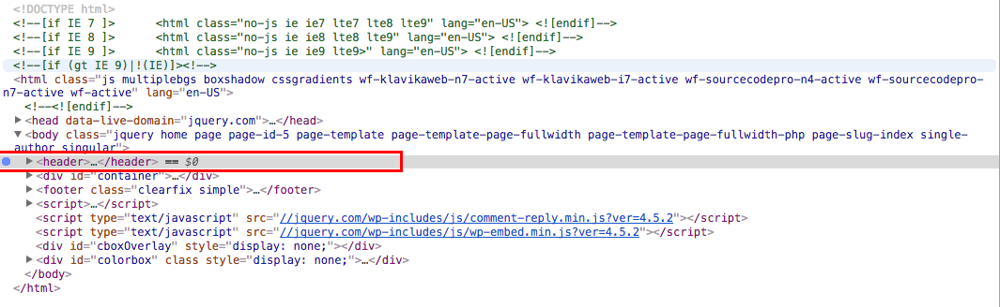

    我在 Console 中输入这一句代码并回车：

    ```javascript
    $("header").attr("id", "my-header")
    ```

    你会发现页面处于 debug 模式，并且代码会跳转到修改选中节点属性的 JavaScript 代码那里：

    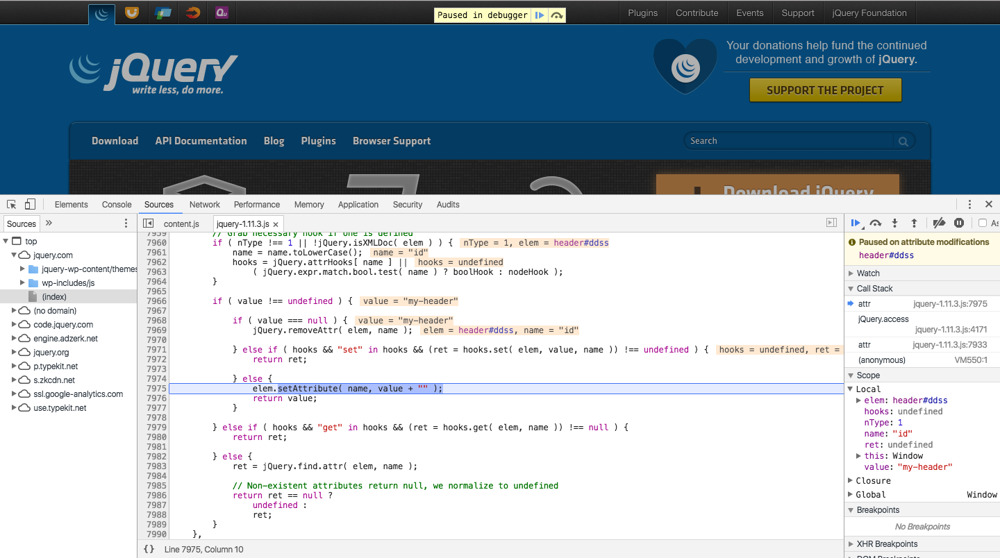


## 样式

其实把右边的那一块统称为样式有点不恰当，因为这一块主要由 5 个小的面板组成：

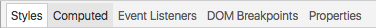

分别是：

- Style：实时编辑与所选元素相关的样式
- Computed：检查编辑所选元素的盒模型
- Event Listeners：查看与所选元素相关的 JS 事件监听
- DOM Breakpoints
- Properties

### Styles

Styles 面板可以允许你通过各种方式来修改元素的样式，并且会想方设法使得你调试时简单方便。

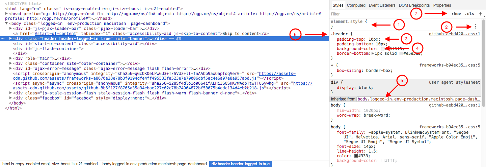

按照上图标注的序号进行描述：

1. element.style：代表所选元素的内联样式。比如我选择的是 Github 的 header 块，如果我直接修改其 HTML 为 `<div class="header" style="background: red"></div>`，那么 element.style 中就会出现 `background: red;`，相反，如果我在 element.style 块中点击任意空白处，添加 CSS 样式，那么你会在对应的元素节点上看到 style 属性，值就是你写在 element.style 内的内容
2. 鼠标悬浮在 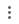 上会出现 ，可以帮助你通过可视化界面的形式调试 text-shadow、 box-shadow、 color、 background。另外，最后一个 "+" 的符号代表可以添加新的 CSS 规则（在 element.style 中没有）
3. 单击属性或者属性值，进行修改，按 tab 键修改下一个属性或值，按 tab + shift 修改上一个属性或值。当值是数字类型时，按上下键可以以 1 为单位递增或递减，按 alt + 上下键以 0.1 为单位递增或递减，shift + 上下键以 10 为单位递增或递减，记不得这些快捷键就老老实实手动输入吧；点击空白处，添加新的样式
4. Style 面板对 color 非常友好，点击色块可以打开取色器（color picker，取色器功能非常强大，大家自行感受），然后对颜色进行可视化编辑。同样的，shadow 属性也能如此
5. 以 "Inherited from ..." 为分界，上面的样式都是作用于元素本身的，下面的都是其继承而来的，继承的对象一般不止一个，可能是父元素，父元素的父元素...
6. 将鼠标悬停在一个选择器上时，可以看到这个选择器所影响的所有页面元素（不包括可视区域外的元素）
7. 这边有 3 个选项
    - 点击 ":hov"，出现 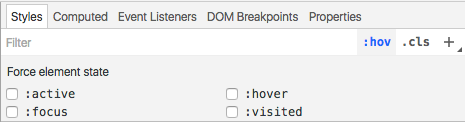，可以强制所选元素处于某个状态，这个也能通过右击元素，选择一个状态来实现
    - 点击 ".cls"，出现 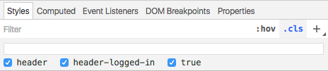，查看所有与当前元素直接相关的样式规则，你可以禁止/允许某个类作用于所选元素，也可以添加新的类
    - 点击 "+"，新建一个样式规则


对样式进行了修改之后，如果你想保存这些修改，你可以参考[这篇文档](https://developers.google.com/web/tools/setup/setup-workflow)。现在的 CSS 文件基本上都是编译后的结果，而保存的文件一般也是编译后的 CSS 文件，所以这么做的作用不大（如果有可以直接保存原始样式文件的方法，大家可以留言）。所以我们一般将 Styles 面板当做一个所见即所得的调试工具。

### Computed

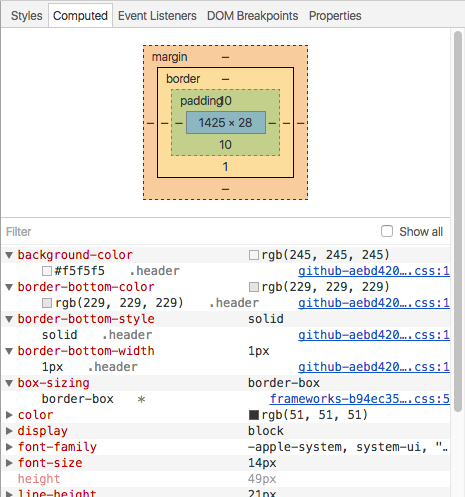

Computed 面板显示了如下内容：

- 所选元素的盒模型
- 所选元素的 CSS 样式以及值，不仅显示最终所采用的值，也显示被覆盖了的值
- 每个属性值所在的文件

鼠标悬停在盒模型上的 margin、border、padding 以及内容区域，可以在网页中看到与之相对应的区域。你还可以双击盒模型上的数字来修改它。如果所选元素的 position 属性的值为 absolute 或者 fixed 的话，还可以在 margin 的外围设置 position。

### Event Listeners

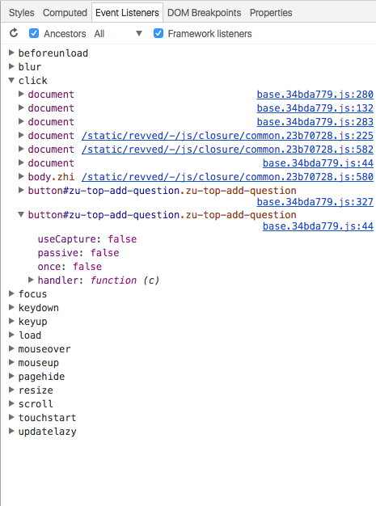

上图截取的是知乎首页顶部的“提问”按钮对应的 `<button class=...>提问</button>`。Event Listeners 面板显示了这个节点注册的所有事件类型，展开一个事件类型（这里是 click），可以看到这个类型下的所有处理函数。

在面板的顶部有一排选项： 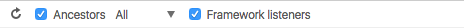。

- Ancestors：禁止则只显示直接定义在所选元素上的事件监听，在我这个例子中结果如图： 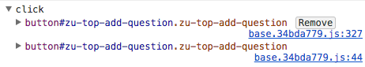，这表明直接定在提问按钮上的事件只有 click，且定义的事件处理函数只有两个
- 监听器类型：Passive / Blocking / All：Passive Event Listener  是从 Chrome 51 开始添加的一个新特性，主要用来让页面滑动更加流畅，详细信息请查看另一篇博客：[Passive Event Listener](../../js/event/Passive Event Listener.md)
- Framework listeners：很多框架、类库都封装了原生的事件，禁止 Framework listeners 可以查看事件在框架或类库的代码下的实现，而允许 Framework listeners 则可以深入框架或类库内部查看事件定义的代码
