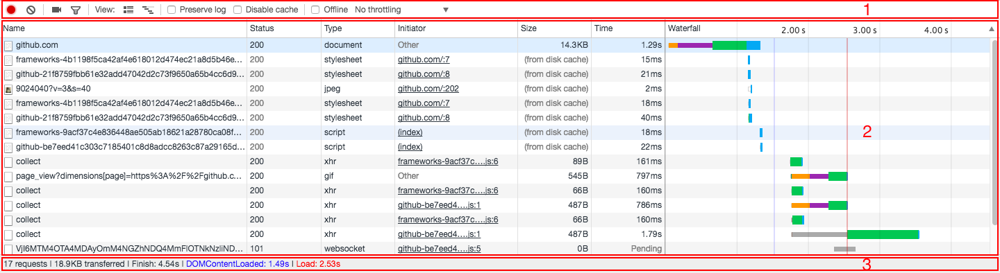
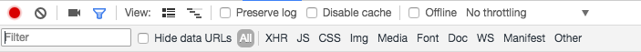
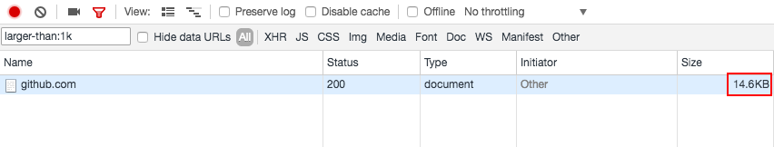
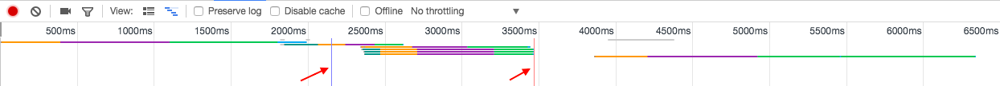
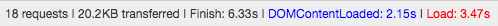
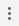

Chrome DevTools 的 Network 面板主要用于度量当前网页的网络性能状况，其记录了当前网页每个网络操作的信息，包括时间数据、HTTP 请求、返回数据等等。

先看 Network 面板长啥样~下面是我 Github 首页的 Network 面板。

Network 面板包含很多小面板，有些是默认隐藏的。其中最主要的一个面板就是控制面板(Control Pane)，即上图中的 "1" 部分，控制面板上有很多的功能按钮。"2" 部分是请求表格(Requests Table)，表格内容按照请求的顺序排序，点击一个请求的 "Name" 列可以查看这个请求的具体信息；在表格的头部，右键可以看到还有很多隐藏的列，比如 Method、Protocol、Domain 等等。"3" 部分是概览(Summary)，主要显示这个网页有多少请求，请求的数据有多大，一共花费了多少时间。

上面是 Network 3 个面板的大概了解，下面就对面板 "1"、"2" 进行重点介绍。

## Control 面板

### 开始/停止记录

 表示正常记录网络的请求状况，点击，当图标变成  时，代表停止记录请求状况。

### 清除记录

点击  可以清除请求表格内的内容。

### 截取加载的瞬间

点击  ，当图标变成  时，代表开启截屏模式，即截取网页在加载过程中的瞬间，这些瞬间显示了网页在什么时间加载出了哪些部分。以我的 Github 首页为例，打开截屏功能后，出现下面的结果：

在控制面板下面出现了一块新的面板，用来显示网页加载过程中的截屏。当鼠标悬浮在一张截图上时，下面的请求表格面板上出现了这张截图加载时的时间；点击一张截图时，请求表格面板也会显示相应时间内加载的资源及其信息；双击一张截图，可以查看这张截图的大图，可通过左右键进行切换。

### 过滤

点击  可以显示/隐藏过滤面板，如下：

可以把过滤面板看成由三个部分组成的面板，从左到右分别是：过滤文本域、隐藏 Data URLs 和请求资源类型选择。

隐藏 Data URLs 比较好理解，对 Data URLs 不理解的可以看：[Data URLs](https://developer.mozilla.org/en-US/docs/Web/HTTP/Basics_of_HTTP/Data_URIs)。在这里主要就是为了隐藏这些用 Data URLs 来展示的资源。

在 "Hide data URLs" 后面有一组文件类型，选择一个可以在下面的请求表格中只显示相应类型的文件请求，当然你还可以在选择的同时按着 ctrl / cmd，那么就可以多选。

下面来说过滤文本域，就是过滤面板最左边的输入框，为什么放到最后讲呢，因为这里面的文章太多了，超出了我们的想象。不卖关子了，下面具体聊聊吧。

首先，最简单的用法就是我们输入一个字符串，然后可以过滤出那些资源名称中包含相应字符串的资源。这是我们一般使用的，除此以外，文本域还支持一些关键词，举个栗子：

上面的例子就用到了 "larger-than" 关键词，后面跟的参数是文件大小，可以刷选出大于 1k 的文件。

下面就看看这些关键词有哪些：

- domain：刷选来自特定域的请求
- has-response-header：刷选 HTTP 返回值包含特定头部信息的请求
- is：可以用 `is:running` 查看 WebSocket 资源
- larger-than：筛选文件大小超过特定数字的请求，默认单位是 byte
- method：刷选特定 HTTP 请求方法的请求
- mime-type：刷选特定 MIME 类型的请求
- mixed-content：有 `mixed-content:all` 和 `mixed-content:displayed` 两种
- scheme：刷选特定 scheme 的请求
- set-cookie-domain：刷选特定的 HTTP 返回头部的 set-cookie 属性的请求
- set-cookie-name：也是对返回的 HTTP 头部中某个属性进行刷选的关键词
- set-cookie-value：同上
- status-code：对请求的状态值进行刷选

说到这，其实也就差不多了，但还有几点需要注意一下：1) 冒号后面不能有空格；2) 大小写敏感。

### Use large request rows

点击  可以看到请求表格的每一行都增高了，显示的信息也更多了。

### 显示/隐藏 overview

我一开始跟很多人一样，看到这个图时觉得头晕，感觉上是显示加载情况的，但又说不出具体什么意思，下面就跟大家一起了解一下这张图的含义。

首先从水平方向上从左看到右，你会看见：

- 刻度：代表时间
- 一条条水平线：一条水平线代表一项资源，这条水平线上的不同的颜色段代表这项资源在加载过程中处于什么阶段
- 有两条竖线：前面一条是蓝色，代表 DOMContentLoaded 事件被触发；后面一条是红色，代表 load 事件被触发。从概览面板也能看到这两个信息：

    

然后从垂直方向看，这些五彩斑斓的水平线有的有重叠有的没有重叠，具有重叠部分说明这些资源是在同一时间被加载的。

讲到这里，也能大概了解这张图的意思了。但还有一个问题，那些颜色代表什么呢？这个放在这篇博客的后面细讲。

### Preserve log

勾选代表：当刷新页面时不清除请求表格内的信息。

### Disable cache

勾选代表：禁用缓存，则当重新刷新页面时所有的数据将会重新获取，而不使用缓存。

### Offline

勾选代表：使得网页处于离线状态。

### 模拟网络状况

当开发的是一款移动应用时，常常要考虑移动设备的网络状况。Chrome DevTools 可以模拟各种各样的网络状况。上面的 Offline 仅仅是一种情况。点击 Offline 后面的下拉框，可以发现 Chrome 自带了很多网络状况，比如 4G、3G 甚至 Offline 等等。默认的是反应真实的网络条件（自己当前的网络状况），即 No throttling。Throttle 这个词很形象，阀门，可以用它来调节流量的速度。除此以外，你还可以自定义网络状况。

除了在 Network 面板可以设置网络状况，还可以在 Drawer 中看见。具体有两种方法：

1.  -> More tools -> Network conditions
2. 按 esc 键调出 Console Drawer，在 Console Tab 旁边也有 ，点击，选择 Network conditions
