在 Chrome 中调试 JS 代码，那你不得不与 Chrome DevTools 的 Sources 面板打交道，所以文章主要通过介绍 Sources 面板上的各部分功能来介绍如何调试网页中的 JS。

## 熟悉 Sources 面板

先来认识一下 Sources 面板(以我的 Github 首页举例)。

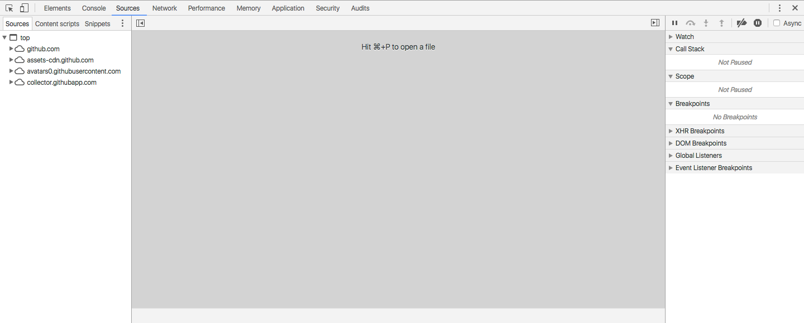

可以看到面板被分为左中右三个部分，左边是文件导航，中间是文件的具体内容，右边可以统称为调试面板。整个面板就像一个 IDE，所以还是挺亲切的。

左边的文件导航面板包含 3 个面板：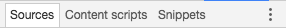，分别是：

- Sources：这个面板很好理解，展示了网页所用到的所有文件
- Content scripts：Content scripts 指的是 Chrome 拓展注入在网页中的脚本。比如我安装了一个叫 JSONView 的 Chrome 拓展，打开我的 Content scripts 面板会看到：

    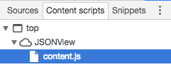

- Snippets：Snippets 的含义是片段，在这里指的是一小段程序，这个一小段程序跟在其他地方不一样的是，可以访问这个页面中的变量和函数等。

中间有 3 点需要提一下，其他的操作都比较显而易见。另外需要提一下的是打开文件，可以用快捷键 Cmd + p / Ctrl + p 来在任何一个功能面板上打开一个文件。

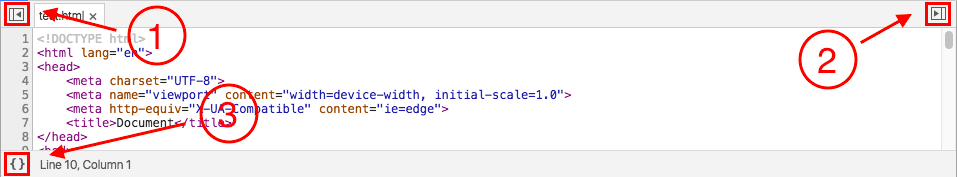

标记 1、2 处可以隐藏/展开左右两个面板，标记 3 处格式化代码，当代码被压缩时尤其有用。

右边的调试面板比较复杂，需要借助调试的例子来解释作用。不过我们可以先大概熟悉一下：

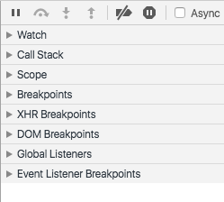

右侧的面板为上下结构，上面是一组功能按钮，下面由很多面板组成，这些面板中，看名字大概能知道第二个显示的是调用栈，从四个开始就是各种类型的断点。那真相是什么呢？我们下面结合调试实例来解释这些按钮/面板的功能。

## 添加断点与断点类型

本文用到的测试代码为自己所写。

### 添加断点

打开一个文件，中间的面板中显示了代码，代码的左侧有代码行号，代码行号所在的位置叫做行号槽，点击行号槽，为相应的行添加断点，并在相应的行号上面加上一个类似肩章的五边形图标。特别提一下的是，这个图标的颜色是蓝色的。如下：

另外，如果一条语句由多行组成，如果在这条语句的行中添加断点的话，那么断点将会被加到下一条语句。举例如下：

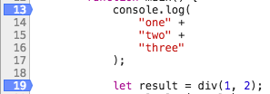

在上面的代码中，你可以在 13 行添加断点，但如果你想在 14-17 行添加断点的话，那么断点将会被添加到 19 行。另外，你也不能为空行添加断点，那也会被添加到下一条语句上。比如你想在 18 行添加断点，但实际会被添加到 19 行。

**条件断点**

右键一个没有添加断点的行号，选择 "Add conditional breakpoint"，输入你的条件，当条件满足时，断点才会生效。回车后，效果如下：

可以看见，条件断点跟一般断点的区别就是颜色变成了黄色。

**行内断点**

之前有人在评论里问，为什么我的这个系列文章要加一个 v57 这个前提，行内断点就是一个很好的回答。行内断点是从 Chrome(v55) 才有的一个功能，意思是你可以在一行内添加多个断点。看下面的例子：

跟前面添加断点方式一样，我先在 15 行添加了一个断点，当程序中断在 15 行时，出现了上图的例子。但与一般的例子不同的是，上面有 3 处标红的位置，表示 3 处断点。但第 1 个断点跟后 2 个不一样的是，第 1 个断点是默认处于激活状态，而后 2 个则不是，只有点击激活后才能生效。

### 断点的其他操作

- 忽略：如果你想暂时忽略某个断点，右键断点，选择 "Disable breakpoint"
- 修改：修改断点生效的条件。你可以将一个非条件断点通过这个方式修改成条件断点，也可以将条件断点变成非条件断点
- 删除：你可以直接点击断点，或者右键 "Remove breakpoint"

### 黑盒脚本

右键行号槽的时候，第一个选项总是："Blackbox Script"。

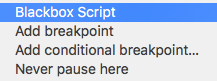

那什么是黑盒脚本呢？

我们写项目时，很多时候是要引用第三方库或框架的，当我们调试时，调试的对象应该是我们自己写的代码，但很多时候，我们经常在焦灼地进行下一步下一步时，突然代码跳到了第三方库或框架的源码上去，这让我们焦灼的内心更添了一把柴火。黑盒脚本就是用来解决这个问题的。它能够将一个脚本文件标记为 "Blackbox Script"，那么我们就**永远**不可能进入这个文件内部，这个文件对我们来讲就是一个黑盒子。为什么要强调“永远”呢？因为不仅普通的断点不能访问这个被标记了的脚本，其他的，比如说 DOM 断点、事件断点等等都无法访问那个脚本文件内部。

### 面板介绍 -- Breakpoints

这个面板会显示你所有的通过行号留下的断点。你可以右键管理某个或全部断点：

- Remove Breakpoints：删除选中的断点
- Deactivate Breakpoints：暂时忽略所有断点
- Disable all Breakpoints：功能同上（与上一功能有细微差别，但表现类似）
- Remove all Breakpoints：删除所有断点

除了普通的中断类型，我们下面再介绍几款其他类型的。

### 面板介绍 -- DOM Breakpoints

在 Elements 面板，右键 body 元素，插入 "attribute modifications breakpoint"，在 Sources 面板中显示如下：

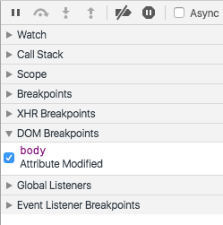

查看 DOM 断点的详细信息请查看另一篇博客：[Elements](./Elements.md)

### 面板介绍 -- XHR Breakpoints

XHR 断点跟 DOM 断点很类似，通过 XHR 断点可以很容易的找到 ajax 调用的触发点和调用堆栈。最新的 Chrome DevTools 中要么为所有 ajax 调用添加断点，要么都不添加断点。

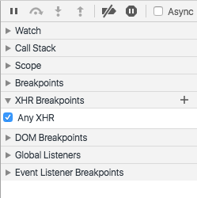

### 面板介绍 -- Event Listener Breakpoints

展开 Event Listener Breakpoints 可以看到一组事件类型，展开一个事件类型可以看到具体的事件名称。

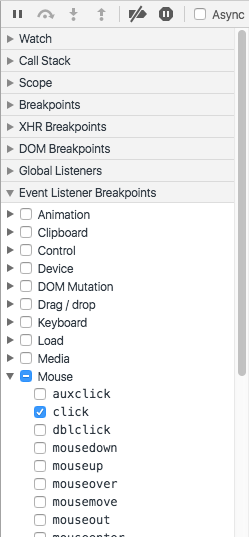

每个事件名称和事件类型前面都有个复选框，选中即指当页面中触发了所选的事件的话，就会触发中断。

### 面板介绍 -- Global Listeners

显示全局监听器，在浏览器中 window 是全局对象，所以在 Global Listeners 面板中显示绑定在 window 对象上的事件监听。

### 异常中断

这个跟上面几种不一样，这个是放在功能按钮组里面的。

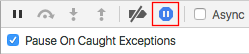

选中 "Pause on exceptions" 按钮，如上图，当执行的脚本出现异常时会触发中断。

介绍了如何添加断点方式以及几款中断类型，下面介绍一下如何利用断点进行调试。

## 断点调试

### 功能按钮

我们先来介绍几个功能按钮：

- ：当程序中断在断点处时，点击去往下一个断点
- ：当程序中断在断点处时，长按上面的按钮出现，点击这个按钮可以在 0.5s 内忽略任何中断，当中断出现在循环内部时一般比较有用
- ：执行下一条语句
- ：当中断停留在一个函数调用处时，点击这个按钮会进入函数内部，而上面的按钮则会执行函数调用的下一句，不会进入函数内部
- ：当中断停留在函数内部时，点击这个按钮则会跳出函数内部，停留在函数调用的下一个语句
- ：在不取消断点标记的情况下，使得所有断点失效

### 面板介绍 -- Scope

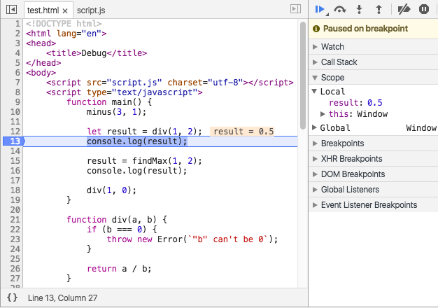

Scope 面板显示了你当前定义的所有属性的值，例子如上图。除了 Scope 面板，你还可以在左侧的代码区域，中断的旁边看到语句中包含的变量的值。除此以外，你还可以把鼠标放在变量上面，也显示对应变量的值。

Scope 会显示三种类型的值： Local、Closure 和 Global。

### 面板介绍 -- Call Stack

当代码中断在一处时，Call Stack 面板会显示代码的执行路径。比如在 a() 中调用了 b()，b() 中调用了 c()，那么中断如果在 c() 内部的话，那么 Call Stack 面板会依次显示 c、b、a。

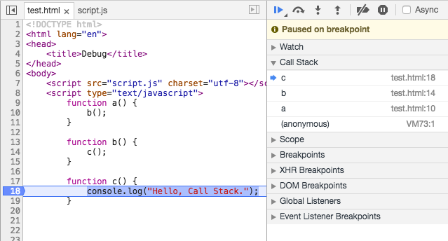

在 JS 中，我们常常会写匿名函数，显而易见，在调试时，尤其在查看调用栈时，这样很不友好，所以建议尽量为每个函数命名。

如果还记得前面所讲的黑盒脚本（Blackbox Script）的话，这里就再重复一句，是的，黑盒脚本永远不可见，所以你即使在查看调用栈时你也没法看到黑盒脚本里的内容。这种情况下会出现下面这样的结果：

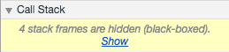

### 查看与修改你的值

前面讲 Scope 面板时介绍了三种查看中断状态下的变量值，还有一个隐蔽的小技巧也能查看，按 esc 按键打开 Console drawer（不清楚是什么可以看[Console](./Console.md)），然后在里面输入你想查看的值，回车，bingo~

如果你以为 Chrome DevTools 就简单看看这些值那就太小瞧她了，在中断状态下，还能动态修改变量的值。比如中断处有个变量叫 v，值是 1，如果我直接按 "Resume script execution" 的话，那么下一次的 v 也是 1，但如果我在按恢复执行按钮之前，我在 Console drawer 中输入 `v = 2` 回车，那么，下一处的 v 就是 2 了。

还有更厉害的，你不仅可以修改变量的值，你还可以修改代码！当程序中断时，你可以在 Sources 面板修改你的代码。

介绍到这，还有一个面板：Watch，下面就讲讲这个。

### 面板介绍 -- Watch

正如名字所表示的，观察，观察什么呢？主要观察变量。

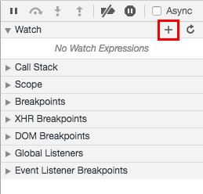

前面我们讲过，当程序中断时，可以查看这个状态下的变量的值，但局限是只能一个一个查看，而 Watch 的好处是可以让我们同时查看多个变量。你可以通过 "+" 来添加变量，当添加的变量存在时会显示对应的值，不存在的话则会显示 "not availble"。需要注意的是，这里的变量不会随着代码的执行而发生改变，所以到了下一个状态时，你需要点击刷新按钮来获得关注的变量的新的值。

### 源码调试

现在的项目几乎都是经过编译过的，所以当我们调试时会与编译后的代码打交道，但那并不是我们想要的。不要急，Chrome DevTools 提供了预处理过的代码与源码的映射，主要表现在两点：

- 在 console 上，源链接指向的是源码，而不是编译后的文件
- 在 debug 时，在 Call Stack 面板上的源链接指向的也是源码，不是编译后的文件

不过需要注意的是，上面所讲的能查看源码的前提是 Chrome DevTools 在设置中提供了相应权限，具体是：Settings - Sources - Enable Javascript source maps / Enable CSS source maps，勾选这两项即可。不过，默认情况下就是勾选。
